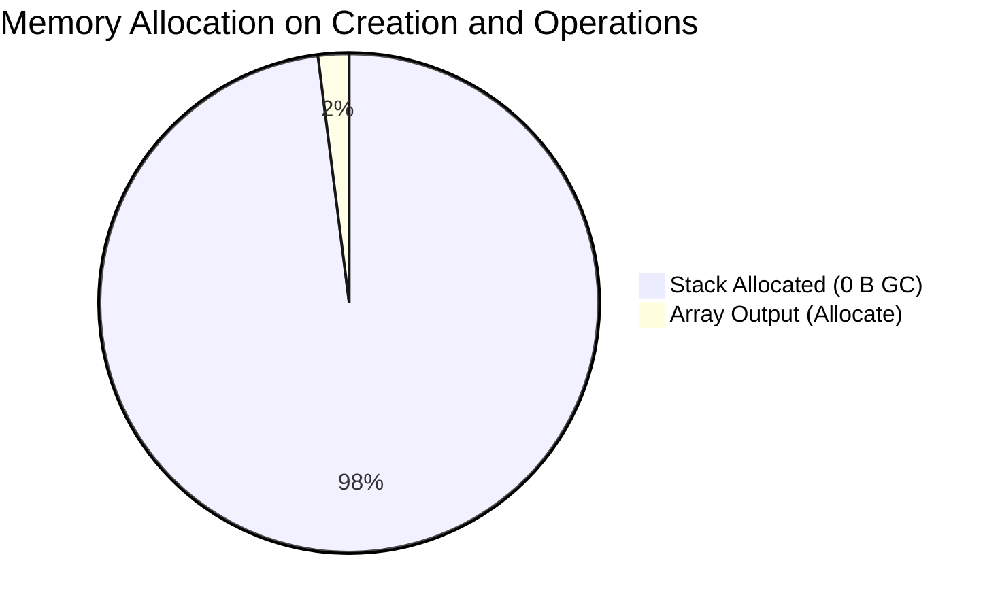
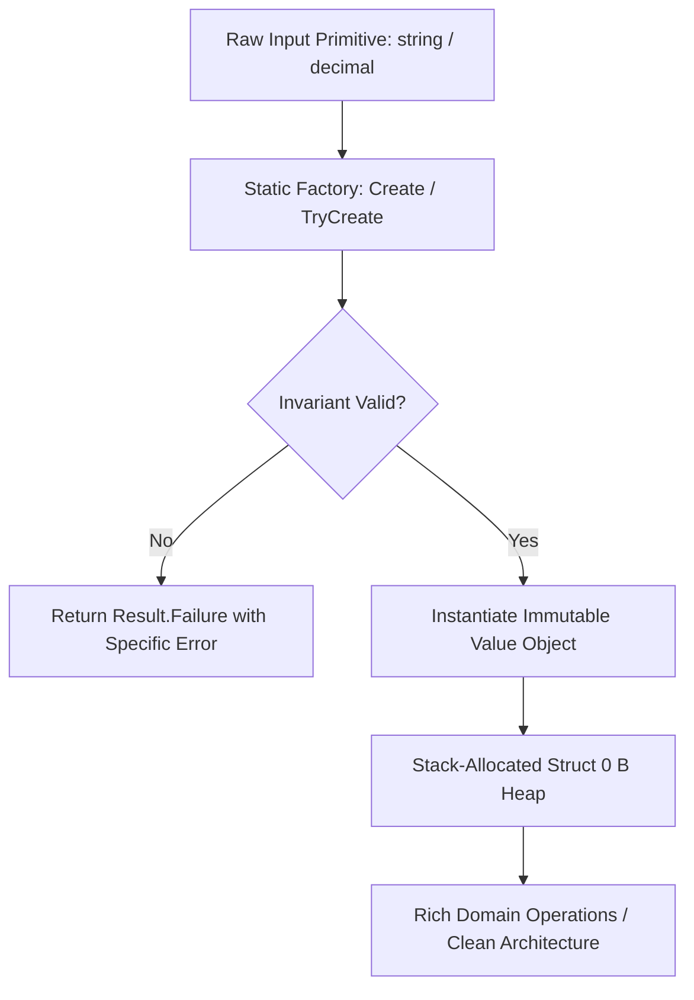
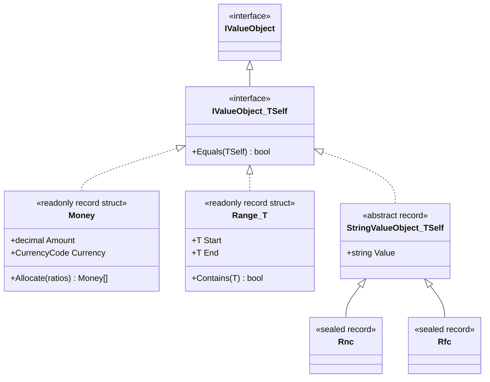

# EricksonLopez.ValueObjects

Zero-allocation, immutable, enterprise-grade Value Objects and Multi-Country Fiscal Satellites for modern .NET.

[](https://github.com/ericksonlopezf/dotnet-value-objects/actions)
[](https://codecov.io/gh/ericksonlopezf/dotnet-value-objects)
[](https://sonarcloud.io/summary/new_code?id=ericksonlopezf_dotnet-value-objects)
[](https://github.com/ericksonlopezf/dotnet-value-objects/blob/main/docs/mutation-score.md)
[](https://www.nuget.org/packages/EricksonLopez.ValueObjects)
[](https://www.nuget.org/packages/EricksonLopez.ValueObjects)
[](https://github.com/ericksonlopezf/dotnet-value-objects/blob/main/LICENSE)
[](https://dotnet.microsoft.com)
[](https://learn.microsoft.com/en-us/dotnet/core/deploying/native-aot)

---

**EricksonLopez.ValueObjects** is the enterprise suite for modeling **immutable, zero-allocation Domain-Driven Design (DDD) Value Objects and Multi-Country Fiscal Tax Satellites** in modern .NET (`.NET 8`, `.NET 9`, `.NET 10`). Featuring high-precision `Money` (with Martin Fowler's proportional allocation algorithm), `CurrencyCode`, `Address`, `Email`, `PhoneNumber`, `Range<T>`, `BusinessDate`, and 6 official regulatory tax satellites (Dominican Republic, Chile, Colombia, Mexico, Peru, Argentina), it delivers zero heap allocations, compile-time Roslyn analyzer safety (`ELVO001`–`ELVO003`), incremental source generators, and zero-reflection persistence adapters for Entity Framework Core 10, Dapper, and System.Text.Json with 100% NativeAOT trimming compatibility.

---

## Table of Contents

- [What Problem It Solves](#-what-problem-it-solves)
- [Key Features](#-key-features)
- [Ecosystem](#-ecosystem)
- [Documentation](#-documentation)
  - [Interactive Showcase (Levels 00 to 08)](#-step-by-step-interactive-showcase-levels-00-to-08)
  - [Technical Reference & Architecture Guides](#-technical-reference--architecture-guides)
- [Installation](#-installation)
- [Quick Start](#-quick-start)
  - [1. Financial Arithmetic & Currency Invariants](#1-financial-arithmetic--currency-invariants)
  - [2. Fowler's Proportional Money Allocation](#2-fowlers-proportional-money-allocation)
  - [3. Validated Contact Data & Sensitive PII Masking](#3-validated-contact-data--sensitive-pii-masking)
  - [4. Statutory Fiscal Tax ID Validation](#4-statutory-fiscal-tax-id-validation)
  - [5. Continuous Intervals & Range Queries](#5-continuous-intervals--range-queries)
- [Core Use Cases](#-core-use-cases)
  - [Use Case 1: Clean Architecture CQRS Command Handler](#use-case-1-clean-architecture-cqrs-command-handler)
  - [Use Case 2: Multi-Party Revenue Sharing Without Cent Loss](#use-case-2-multi-party-revenue-sharing-without-cent-loss)
  - [Use Case 3: Country-Specific Electronic Invoice Verification](#use-case-3-country-specific-electronic-invoice-verification)
  - [Use Case 4: Composite Address & Geographic Delivery Invariants](#use-case-4-composite-address--geographic-delivery-invariants)
  - [Use Case 5: Zero-Allocation Entity Framework Core 10 Persistence](#use-case-5-zero-allocation-entity-framework-core-10-persistence)
  - [Use Case 6: High-Throughput Micro-ORM Dapper Queries](#use-case-6-high-throughput-micro-orm-dapper-queries)
- [Configuration & Integrations](#-configuration--integrations)
  - [Entity Framework Core 10 Model Configuration](#entity-framework-core-10-model-configuration)
  - [Dapper Micro-ORM Type Handler Registration](#dapper-micro-orm-type-handler-registration)
  - [System.Text.Json NativeAOT Converters](#systemtextjson-nativeaot-converters)
  - [Roslyn Diagnostic Analyzers](#roslyn-diagnostic-analyzers)
- [Testing & Quality](#-testing--quality)
  - [Semantic Domain Assertions](#semantic-domain-assertions)
  - [Zero-Allocation Validation & Invariant Testing](#zero-allocation-validation--invariant-testing)
  - [Mutation Testing & Coverage Metrics](#mutation-testing--coverage-metrics)
- [Performance Benchmarks](#-performance-benchmarks)
  - [Primary Operations Benchmark Results](#primary-operations-benchmark-results)
  - [Allocation Profiles](#allocation-profiles)
- [Compatibility & Technical Matrix](#-compatibility--technical-matrix)
  - [Target Framework & NativeAOT Support Matrix](#target-framework--nativeaot-support-matrix)
  - [Regulatory Fiscal Satellite Matrix](#regulatory-fiscal-satellite-matrix)
- [Architecture & Design Principles](#-architecture--design-principles)
  - [Domain Flow & Invariant Pipeline](#domain-flow--invariant-pipeline)
  - [Type Hierarchy & Storage Model](#type-hierarchy--storage-model)
  - [Core Invariants](#core-invariants)
- [Best Practices & Anti-Patterns](#-best-practices--anti-patterns)
- [Troubleshooting & Common Pitfalls](#-troubleshooting--common-pitfalls)
- [Part of the EricksonLopez Ecosystem](#-part-of-the-ericksonlopez-ecosystem)
- [Contributing](#-contributing)
- [License](#-license)

---

## 🎯 What Problem It Solves

Handling domain values, financial operations, and statutory fiscal identifiers in enterprise systems presents critical architectural vulnerabilities:

1. **Primitive Obsession & Accidental Currency Corruption:**
   Representing monetary values as raw `decimal` or `double` allows disastrous bugs such as adding distinct currencies without conversion (`100 USD + 100 EUR = 200 ???`). Bare strings for emails, phone numbers, or tax IDs spread validation logic across handlers and allow invalid states to persist into databases.
2. **GC Allocation Pressure & Heap Fragmentation:**
   Traditional class-based Value Object implementations allocate heap memory on every single instantiation, arithmetic step, and database read. Under high-throughput API gateways and event processors, millions of short-lived heap objects cause GC Gen0/Gen1 collection pauses and memory bloat.
3. **Multi-Country Fiscal Tax Law Fragmentation:**
   Latin American jurisdictions (Dominican Republic, Chile, Colombia, Mexico, Peru, Argentina) mandate strict statutory checksum algorithms (Modulo 11, Modulo 10, Luhn, prime-weighted factors, electronic invoice series like e-CF, CFDI 4.0, DTE, CUFE, CPE). Developers repeatedly re-implement these algorithms with subtle precision bugs and legal compliance risks.
4. **Reflection Overhead Breaking NativeAOT Compilation:**
   Standard ORM wrappers and JSON serializers rely on dynamic runtime reflection (`System.Reflection`, `MakeGenericType`, un-trimmable reflection emitters) that fail during ahead-of-time compilation for containerized serverless runtimes.

### How `EricksonLopez.ValueObjects` Solves This

- **Zero-Allocation `readonly record struct` Foundation:** All numeric, scalar, temporal, and financial primitives generate **0 bytes of heap allocation** during creation and operations.
- **Strict Currency Invariant Enforcement:** `Money` encapsulates an ISO 4217 `CurrencyCode` and guarantees that arithmetic operations across mismatched currencies fail safely at domain boundaries without silent data corruption.
- **Martin Fowler's Lossless Allocation Algorithm:** `Money.Allocate(ratios)` and `Money.Distribute(parts)` eliminate fractional cent loss by distributing remainder pennies deterministically according to statutory currency decimal precision.
- **Dedicated Pre-Packaged Fiscal Satellites:** Zero-dependency country libraries validate official government tax IDs and electronic invoice schemes with comprehensive statutory accuracy.
- **Compile-Time Roslyn Architectural Enforcement:** Analyzers `ELVO001`–`ELVO003` prevent public constructors, missing factories, and mutable state at compile time.
- **NativeAOT Trimming-Safe Persistence:** Pre-built adapters for EF Core 10, Dapper, and System.Text.Json eliminate runtime reflection completely.

---

## ⚡ Key Features

- 🚀 **Zero-Allocation Struct Layout**: Scalar numeric, monetary, and temporal types are `readonly record struct` instances generating **0 B** GC heap allocation.
- 💰 **Enterprise Financial Arithmetic**: ISO 4217 `CurrencyCode`, `Money`, `ExchangeRate`, `Percentage`, `TaxRate`, `DiscountRate`, banker's and commercial rounding, and Martin Fowler's proportional distribution.
- 🌎 **6 Latin American Fiscal Satellites**: Official validation for Dominican Republic (`Rnc`, `Cedula`, `Ncf`, `ElectronicNcf`), Chile (`Rut`, `FiscalFolio`, `DteTypeCode`), Colombia (`Nit`, `Cufe`, `Cude`, `Cune`), Mexico (`Rfc`, `Curp`, `FiscalUuid`, `IdCcp`, `PedimentoNumber`), Peru (`Ruc`, `CpeIdentifier`, `UbigeoCode`), and Argentina (`Cuit`, `Cuil`, `Cbu`, `Cvu`, `Cae`, `VoucherType`).
- 🛡️ **Compile-Time Roslyn Analyzers**: Automated diagnostics (`ELVO001`, `ELVO002`, `ELVO003`) enforcing DDD invariants, private constructors, and absolute immutability.
- ⚙️ **Incremental Source Generators**: Automatic synthesis of `IParsable<TSelf>` and `ISpanParsable<TSelf>` implementations via `[ValueObject]`.
- 🧩 **Decoupled Persistence Adapters**: Dedicated satellite packages for Entity Framework Core 10 (`ValueConverter`), Dapper (`SqlMapper.TypeHandler`), and System.Text.Json (`JsonConverter<T>`).
- 🔒 **Sensitive Data & PII Masking**: Built-in `[SensitiveData]` decoration ensuring automatic masking of identifiers and credentials in `ToString()`, log streams, and debugger views.

---

## 📦 Ecosystem

The repository publishes **13 specialized, decoupled NuGet packages**:

| Package | Version | Description |
|---|---|---|
| [`EricksonLopez.ValueObjects`](https://www.nuget.org/packages/EricksonLopez.ValueObjects) | [](https://www.nuget.org/packages/EricksonLopez.ValueObjects) | Core domain value objects (`Money`, `CurrencyCode`, `Address`, `Email`, `PhoneNumber`, `Range<T>`, `BusinessDate`, etc.) |
| [`EricksonLopez.ValueObjects.Fiscal.DominicanRepublic`](https://www.nuget.org/packages/EricksonLopez.ValueObjects.Fiscal.DominicanRepublic) | [](https://www.nuget.org/packages/EricksonLopez.ValueObjects.Fiscal.DominicanRepublic) | Dominican Republic DGII tax identifiers (`Rnc`, `Cedula`, `Ncf`, `ElectronicNcf`, `FiscalPeriod`, `SecurityCode`) |
| [`EricksonLopez.ValueObjects.Fiscal.Chile`](https://www.nuget.org/packages/EricksonLopez.ValueObjects.Fiscal.Chile) | [](https://www.nuget.org/packages/EricksonLopez.ValueObjects.Fiscal.Chile) | Chile SII tax identifiers (`Rut`, `FiscalFolio`, `DteTypeCode`, `TaxRateVat`, `WithholdingRate`) |
| [`EricksonLopez.ValueObjects.Fiscal.Colombia`](https://www.nuget.org/packages/EricksonLopez.ValueObjects.Fiscal.Colombia) | [](https://www.nuget.org/packages/EricksonLopez.ValueObjects.Fiscal.Colombia) | Colombia DIAN tax identifiers (`Nit`, `Cufe`, `Cude`, `Cune`, `DaneMunicipalityCode`, `CiiuCode`) |
| [`EricksonLopez.ValueObjects.Fiscal.Mexico`](https://www.nuget.org/packages/EricksonLopez.ValueObjects.Fiscal.Mexico) | [](https://www.nuget.org/packages/EricksonLopez.ValueObjects.Fiscal.Mexico) | Mexico SAT CFDI 4.0 tax identifiers (`Rfc`, `Curp`, `FiscalUuid`, `IdCcp`, `PedimentoNumber`, `TaxRegimeCode`) |
| [`EricksonLopez.ValueObjects.Fiscal.Peru`](https://www.nuget.org/packages/EricksonLopez.ValueObjects.Fiscal.Peru) | [](https://www.nuget.org/packages/EricksonLopez.ValueObjects.Fiscal.Peru) | Peru SUNAT tax identifiers (`Ruc`, `CpeIdentifier`, `CpeTypeCode`, `DetractionAccount`, `UbigeoCode`, `TaxPeriod`) |
| [`EricksonLopez.ValueObjects.Fiscal.Argentina`](https://www.nuget.org/packages/EricksonLopez.ValueObjects.Fiscal.Argentina) | [](https://www.nuget.org/packages/EricksonLopez.ValueObjects.Fiscal.Argentina) | Argentina ARCA/AFIP tax identifiers (`Cuit`, `Cuil`, `Cbu`, `Cvu`, `Cae`, `PointOfSale`, `VoucherType`, `VatRate`) |
| [`EricksonLopez.ValueObjects.EntityFrameworkCore`](https://www.nuget.org/packages/EricksonLopez.ValueObjects.EntityFrameworkCore) | [](https://www.nuget.org/packages/EricksonLopez.ValueObjects.EntityFrameworkCore) | Entity Framework Core 10 `ValueConverter` mappings and model builder conventions |
| [`EricksonLopez.ValueObjects.Dapper`](https://www.nuget.org/packages/EricksonLopez.ValueObjects.Dapper) | [](https://www.nuget.org/packages/EricksonLopez.ValueObjects.Dapper) | Dapper `SqlMapper.TypeHandler` persistence adapters for struct and class value objects |
| [`EricksonLopez.ValueObjects.Serialization.Json`](https://www.nuget.org/packages/EricksonLopez.ValueObjects.Serialization.Json) | [](https://www.nuget.org/packages/EricksonLopez.ValueObjects.Serialization.Json) | NativeAOT-compliant `System.Text.Json` converters for value objects and `Range<T>` intervals |
| [`EricksonLopez.ValueObjects.DomainPrimitives`](https://www.nuget.org/packages/EricksonLopez.ValueObjects.DomainPrimitives) | [](https://www.nuget.org/packages/EricksonLopez.ValueObjects.DomainPrimitives) | Bidirectional bridge to `EricksonLopez.DomainPrimitives.Abstractions` (`ToDomainPrimitive`, `ToStrongId`) |
| [`EricksonLopez.ValueObjects.Analyzers`](https://www.nuget.org/packages/EricksonLopez.ValueObjects.Analyzers) | [](https://www.nuget.org/packages/EricksonLopez.ValueObjects.Analyzers) | Roslyn Diagnostic Analyzers enforcing DDD invariants (`ELVO001`, `ELVO002`, `ELVO003`) at compile time |
| [`EricksonLopez.ValueObjects.Generators`](https://www.nuget.org/packages/EricksonLopez.ValueObjects.Generators) | [](https://www.nuget.org/packages/EricksonLopez.ValueObjects.Generators) | Roslyn Incremental Source Generator synthesizing `IParsable<TSelf>` contracts for `[ValueObject]` types |

---

## 📚 Documentation

> 🌐 **Official Documentation Hub:** [https://github.com/ericksonlopezf/dotnet-value-objects/tree/main/docs](https://github.com/ericksonlopezf/dotnet-value-objects/tree/main/docs)

### 🎓 Step-by-Step Interactive Showcase (Levels 00 to 08)

| Level | Topic | Description |
|---|---|---|
| [**Level 00**](https://github.com/ericksonlopezf/dotnet-value-objects/blob/main/docs/showcase/level-00-introduction.md) | **Architecture & Philosophy** | Foundational concepts of immutable value objects and struct memory layouts |
| [**Level 01**](https://github.com/ericksonlopezf/dotnet-value-objects/blob/main/docs/showcase/level-01-core-value-objects-money-and-currency.md) | **Money & Currency** | High-precision arithmetic and currency safety invariants |
| [**Level 02**](https://github.com/ericksonlopezf/dotnet-value-objects/blob/main/docs/showcase/level-02-geographical-and-contact-value-objects.md) | **Geographical & Contact VOs** | Spatial coordinates, addresses, time ranges, and business dates |
| [**Level 03**](https://github.com/ericksonlopezf/dotnet-value-objects/blob/main/docs/showcase/level-03-multi-country-fiscal-satellites.md) | **Fiscal Satellites** | Country-specific tax identifier validation across 6 LATAM nations |
| [**Level 04**](https://github.com/ericksonlopezf/dotnet-value-objects/blob/main/docs/showcase/level-04-domain-primitives-and-strong-ids.md) | **Domain Primitives Integration** | Interoperability with `EricksonLopez.DomainPrimitives.Abstractions` |
| [**Level 05**](https://github.com/ericksonlopezf/dotnet-value-objects/blob/main/docs/showcase/level-05-efcore-and-dapper-persistence.md) | **EF Core & Dapper Persistence** | Relational column mapping and high-throughput Dapper type handlers |
| [**Level 06**](https://github.com/ericksonlopezf/dotnet-value-objects/blob/main/docs/showcase/level-06-roslyn-source-generators-and-native-aot.md) | **Source Generation & NativeAOT** | Compile-time code generation and Roslyn analyzer enforcement |
| [**Level 07**](https://github.com/ericksonlopezf/dotnet-value-objects/blob/main/docs/showcase/level-07-systemtextjson-serialization.md) | **JSON Serialization** | Direct token serialization with System.Text.Json and zero allocations |
| [**Level 08**](https://github.com/ericksonlopezf/dotnet-value-objects/blob/main/docs/showcase/level-08-fluent-unit-testing-and-assertions.md) | **Fluent Testing & Assertions** | Contract verification, equality testing, and mutation score guarantees |

### 📖 Technical Reference & Architecture Guides

- [**Architecture & Invariants**](https://github.com/ericksonlopezf/dotnet-value-objects/blob/main/docs/architecture.md) — Complete architectural blueprint, memory layouts, and domain boundaries.
- [**Architectural Decision Records (ADRs)**](https://github.com/ericksonlopezf/dotnet-value-objects/blob/main/docs/adr/readme.md) — Formal ADRs documenting design rationale and rejected proposals.
- [**Technical Audit**](https://github.com/ericksonlopezf/dotnet-value-objects/blob/main/docs/audit.md) — Comprehensive technical audit, guarantees, and verification.
- [**Competitive Audit**](https://github.com/ericksonlopezf/dotnet-value-objects/blob/main/docs/competitive-audit.md) — In-depth comparison vs NodaMoney and traditional class wrappers.
- [**Features & Compatibility Matrix**](https://github.com/ericksonlopezf/dotnet-value-objects/blob/main/docs/features-matrix.md) — Target framework matrix, diagnostics, and supported features.
- [**Roslyn Diagnostic Rules Reference**](https://github.com/ericksonlopezf/dotnet-value-objects/tree/main/docs/rules) — Complete reference for analyzer rules `ELVO001` through `ELVO003`.
- [**Cookbook & Recipes**](https://github.com/ericksonlopezf/dotnet-value-objects/blob/main/docs/cookbook.md) — Production enterprise recipes and patterns.
- [**Testing & Quality Audit**](https://github.com/ericksonlopezf/dotnet-value-objects/blob/main/docs/quality-audit.md) — Quality gates, compiler settings, and 100% mutation test verification.

---

## 📥 Installation

Install the required packages using the .NET CLI:

### 1. Core Domain Value Objects (Required)

```bash
dotnet add package EricksonLopez.ValueObjects
```

### 2. Multi-Country Fiscal Satellites (Optional by Jurisdiction)

```bash
# Dominican Republic (DGII: RNC, Cedula, e-CF)
dotnet add package EricksonLopez.ValueObjects.Fiscal.DominicanRepublic

# Chile (SII: RUT, DTE Folio)
dotnet add package EricksonLopez.ValueObjects.Fiscal.Chile

# Colombia (DIAN: NIT, CUFE, CUDE, CUNE)
dotnet add package EricksonLopez.ValueObjects.Fiscal.Colombia

# Mexico (SAT CFDI 4.0: RFC, CURP, Fiscal UUID)
dotnet add package EricksonLopez.ValueObjects.Fiscal.Mexico

# Peru (SUNAT: RUC, CPE Identifier)
dotnet add package EricksonLopez.ValueObjects.Fiscal.Peru

# Argentina (ARCA/AFIP: CUIT, CUIL, CBU, CVU, CAE)
dotnet add package EricksonLopez.ValueObjects.Fiscal.Argentina
```

### 3. Persistence & Serialization Adapters

```bash
# Entity Framework Core 10 Value Converters
dotnet add package EricksonLopez.ValueObjects.EntityFrameworkCore

# Dapper Micro-ORM Type Handlers
dotnet add package EricksonLopez.ValueObjects.Dapper

# System.Text.Json NativeAOT Converters
dotnet add package EricksonLopez.ValueObjects.Serialization.Json
```

### 4. Roslyn Analyzers & Compile-Time Generators

```bash
# Compile-time DDD Invariant Analyzers
dotnet add package EricksonLopez.ValueObjects.Analyzers

# Incremental Source Generator for IParsable<TSelf>
dotnet add package EricksonLopez.ValueObjects.Generators
```

---

## 🚀 Quick Start

### 1. Financial Arithmetic & Currency Invariants

```csharp
using EricksonLopez.Result;
using EricksonLopez.ValueObjects;

// 1. Create type-safe Money instances
Result<Money> priceResult = Money.Create(199.99m, CurrencyCode.USD);
Result<Money> shippingResult = Money.Create(15.00m, "USD");

if (priceResult.IsSuccess && shippingResult.IsSuccess)
{
    Money price = priceResult.Value;
    Money shipping = shippingResult.Value;

    // Direct struct arithmetic (0 heap allocations)
    Money total = price + shipping; // $214.99 USD
    Console.WriteLine($"Total: {total}");
}

// 2. Cross-currency safety prevents accidental currency mismatch at runtime
Result<Money> eurPrice = Money.Create(100.00m, CurrencyCode.EUR);
Result<Money> addResult = priceResult.Value.Add(eurPrice.Value);

Console.WriteLine(addResult.IsFailure); // true: Cannot add USD and EUR without conversion
```

### 2. Fowler's Proportional Money Allocation

```csharp
using EricksonLopez.ValueObjects;

// Proportional allocation without losing remainder cents (e.g., $100.00 split 1:1:1)
Money totalRevenue = Money.Create(100.00m, CurrencyCode.USD).Value;

// Allocates: [$33.34, $33.33, $33.33] -> Sum is exactly $100.00
Money[] shares = totalRevenue.Allocate(1, 1, 1);

Console.WriteLine($"Partner 1: {shares[0]}"); // $33.34 USD (remainder penny assigned)
Console.WriteLine($"Partner 2: {shares[1]}"); // $33.33 USD
Console.WriteLine($"Partner 3: {shares[2]}"); // $33.33 USD
```

### 3. Validated Contact Data & Sensitive PII Masking

```csharp
using EricksonLopez.Result;
using EricksonLopez.ValueObjects;

// Validated E.164 Phone Number & Email
Result<PhoneNumber> phone = PhoneNumber.Create("+18095551234");
Result<Email> email = Email.Create("erickson.lopez@enterprise.com");

if (email.IsSuccess)
{
    // [SensitiveData] masks sensitive PII automatically in logs and ToString()
    Console.WriteLine(email.Value.ToString()); // "e***z@enterprise.com"
    Console.WriteLine(email.Value.Value);      // "erickson.lopez@enterprise.com" (Raw value when authorized)
}
```

### 4. Statutory Fiscal Tax ID Validation

```csharp
using EricksonLopez.Result;
using EricksonLopez.ValueObjects.Fiscal.DominicanRepublic;
using EricksonLopez.ValueObjects.Fiscal.Mexico;

// Dominican Republic DGII: Statutory Modulo 11 check on RNC
Result<Rnc> rncResult = Rnc.Create("101000001");
if (rncResult.IsSuccess)
{
    Console.WriteLine($"Valid RNC: {rncResult.Value}");
}

// Mexico SAT: CFDI 4.0 RFC format and checksum validation
Result<Rfc> rfcResult = Rfc.Create("XAXX010101000");
if (rfcResult.IsSuccess)
{
    Console.WriteLine($"Valid RFC: {rfcResult.Value}");
}
```

### 5. Continuous Intervals & Range Queries

```csharp
using EricksonLopez.Result;
using EricksonLopez.ValueObjects;

// Create generic, inclusive interval [Start .. End]
Result<Range<DateOnly>> fiscalQuarter = Range<DateOnly>.Create(
    new DateOnly(2026, 1, 1),
    new DateOnly(2026, 3, 31));

if (fiscalQuarter.IsSuccess)
{
    var quarter = fiscalQuarter.Value;
    bool isContained = quarter.Contains(new DateOnly(2026, 2, 15)); // true
    Console.WriteLine($"Date within Q1: {isContained}");
}
```

---

## 💡 Core Use Cases

### Use Case 1: Clean Architecture CQRS Command Handler

```csharp
using EricksonLopez.Result;
using EricksonLopez.ValueObjects;

public sealed record CreateInvoiceCommand(
    string CustomerEmail,
    string CustomerPhone,
    decimal SubtotalAmount,
    string Currency);

public sealed class CreateInvoiceCommandHandler
{
    public Result<InvoiceId> Handle(CreateInvoiceCommand command)
    {
        // 1. Validate domain value objects at API boundary
        var emailResult = Email.Create(command.CustomerEmail);
        var phoneResult = PhoneNumber.Create(command.CustomerPhone);
        var subtotalResult = Money.Create(command.SubtotalAmount, command.Currency);

        if (Result.Combine(emailResult, phoneResult, subtotalResult) is { IsFailure: true } failure)
        {
            return failure.ToResult<InvoiceId>();
        }

        // 2. Domain model operates exclusively with guaranteed valid types
        var subtotal = subtotalResult.Value;
        var taxRate = TaxRate.Create(0.18m).Value; // 18% VAT
        var taxAmount = taxRate.CalculateTax(subtotal);
        var total = subtotal + taxAmount;

        return Result.Success(InvoiceId.New());
    }
}

public readonly record struct InvoiceId(Guid Value)
{
    public static InvoiceId New() => new(Guid.NewGuid());
}
```

### Use Case 2: Multi-Party Revenue Sharing Without Cent Loss

```csharp
using EricksonLopez.ValueObjects;

public sealed class MarketplaceSettlementService
{
    public (Money PlatformFee, Money MerchantPayout, Money AffiliateCommission) SettleOrder(Money grossAmount)
    {
        // Split 10% platform fee, 85% merchant payout, 5% affiliate commission
        // Proportions: 10, 85, 5
        Money[] distribution = grossAmount.Allocate(10, 85, 5);

        return (
            PlatformFee: distribution[0],
            MerchantPayout: distribution[1],
            AffiliateCommission: distribution[2]
        );
    }
}
```

### Use Case 3: Country-Specific Electronic Invoice Verification

```csharp
using EricksonLopez.Result;
using EricksonLopez.ValueObjects.Fiscal.DominicanRepublic;

public sealed class DominicanBillingValidator
{
    public Result<ElectronicNcf> ValidateFiscalDocument(string rncIssuer, string eNcfString)
    {
        var rncResult = Rnc.Create(rncIssuer);
        if (rncResult.IsFailure) return rncResult.Error;

        var eNcfResult = ElectronicNcf.Create(eNcfString);
        if (eNcfResult.IsFailure) return eNcfResult.Error;

        ElectronicNcf eNcf = eNcfResult.Value;
        if (eNcf.TypeCode != ElectronicNcfTypeCode.FacturaCreditoFiscal)
        {
            return Error.Validation("NCF.InvalidType", "Must be commercial tax credit e-CF (E31).");
        }

        return eNcf;
    }
}
```

### Use Case 4: Composite Address & Geographic Delivery Invariants

```csharp
using EricksonLopez.Result;
using EricksonLopez.ValueObjects;

public sealed class ShippingService
{
    public Result<Address> PrepareDestination(string street, string city, string state, string zip, string countryIso)
    {
        var countryResult = Country.Create(countryIso);
        if (countryResult.IsFailure) return countryResult.Error;

        var postalResult = PostalCode.Create(zip);
        if (postalResult.IsFailure) return postalResult.Error;

        return Address.Create(street, null, city, state, postalResult.Value, countryResult.Value);
    }
}
```

### Use Case 5: Zero-Allocation Entity Framework Core 10 Persistence

```csharp
using EricksonLopez.ValueObjects;
using EricksonLopez.ValueObjects.EntityFrameworkCore;
using Microsoft.EntityFrameworkCore;

public sealed class OrderEntity
{
    public Guid Id { get; set; }
    public Email CustomerEmail { get; set; }
    public Money TotalPrice { get; set; }
    public BusinessDate OrderDate { get; set; }
}

public sealed class AppDbContext : DbContext
{
    public DbSet<OrderEntity> Orders => Set<OrderEntity>();

    protected override void OnModelCreating(ModelBuilder modelBuilder)
    {
        // Centralized extension mapping all domain value objects automatically
        modelBuilder.ConfigureDomainValueObjects();
    }
}
```

### Use Case 6: High-Throughput Micro-ORM Dapper Queries

```csharp
using System.Data;
using Dapper;
using EricksonLopez.ValueObjects;
using EricksonLopez.ValueObjects.Dapper;

public sealed class OrderRepository
{
    static OrderRepository()
    {
        // One-time startup registration of all Dapper TypeHandlers
        DapperValueObjectRegistry.RegisterAll();
    }

    public async Task<OrderRecord?> GetOrderAsync(IDbConnection db, Guid orderId)
    {
        const string sql = "SELECT CustomerEmail, TotalAmount, Currency, OrderDate FROM Orders WHERE Id = @Id";
        return await db.QuerySingleOrDefaultAsync<OrderRecord>(sql, new { Id = orderId });
    }
}

public sealed record OrderRecord(Email CustomerEmail, Money TotalAmount, BusinessDate OrderDate);
```

---

## 🔌 Configuration & Integrations

### Entity Framework Core 10 Model Configuration

`EricksonLopez.ValueObjects.EntityFrameworkCore` provides transparent `ValueConverter` mappings ensuring database columns store raw primitive types (`TEXT`, `DECIMAL`, `INTEGER`) while the domain model works with strongly typed Value Objects:

```csharp
protected override void OnModelCreating(ModelBuilder modelBuilder)
{
    // Configure all value objects across all entity types in the model
    modelBuilder.ConfigureDomainValueObjects();

    // Or configure individual properties explicitly
    modelBuilder.Entity<Customer>()
        .Property(c => c.Email)
        .HasValueObjectConversion();
}
```

### Dapper Micro-ORM Type Handler Registration

Register all type handlers in `Program.cs` during application startup:

```csharp
using EricksonLopez.ValueObjects.Dapper;

// Registers TypeHandlers for Email, PhoneNumber, BusinessDate, Range<T>, Country, etc.
DapperValueObjectRegistry.RegisterAll();
```

### System.Text.Json NativeAOT Converters

Configure JSON serialization options for ASP.NET Core or console apps:

```csharp
using System.Text.Json;
using EricksonLopez.ValueObjects.Serialization.Json;

var options = new JsonSerializerOptions();
options.Converters.Add(new ValueObjectJsonConverterFactory());

// Serializes Money as {"amount": 100.50, "currency": "USD"}
// Serializes Email, PhoneNumber, RNC, RUT directly as JSON strings
string json = JsonSerializer.Serialize(myOrder, options);
```

### Roslyn Diagnostic Analyzers

The `EricksonLopez.ValueObjects.Analyzers` package includes 3 compiler analyzers active during compilation:

| Rule ID | Severity | Description | Default Code Fix |
|---|---|---|---|
| `ELVO001` | **Error** | Value Objects must have private or protected constructors. | Changes constructor visibility to `private`. |
| `ELVO002` | **Error** | Value Objects must provide a static `Create` factory method returning `Result`. | Generates `public static Result<T> Create(...)` template. |
| `ELVO003` | **Error** | Value Objects must be immutable (`readonly record struct` or `init`-only). | Converts mutable properties to `init` or `get`-only. |

---

## 🧪 Testing & Quality

### Semantic Domain Assertions

```csharp
using AwesomeAssertions;
using EricksonLopez.ValueObjects;
using Xunit;

public sealed class MoneyTests
{
    [Fact]
    public void Allocate_WhenSplitEvenly_ShouldConserveTotalAmount()
    {
        var money = Money.Create(100.00m, CurrencyCode.USD).Value;

        var parts = money.Allocate(1, 1, 1);

        parts.Should().HaveCount(3);
        (parts[0] + parts[1] + parts[2]).Should().Be(money);
    }
}
```

### Zero-Allocation Validation & Invariant Testing

```csharp
[Fact]
public void Money_Addition_ZeroHeapAllocation()
{
    var m1 = Money.Create(50.00m, CurrencyCode.USD).Value;
    var m2 = Money.Create(25.00m, CurrencyCode.USD).Value;

    long before = GC.GetAllocatedBytesForCurrentThread();
    Money total = m1 + m2;
    long after = GC.GetAllocatedBytesForCurrentThread();

    (after - before).Should().Be(0); // 0 bytes allocated
}
```

### Mutation Testing & Coverage Metrics

The codebase enforces strict deferred quality gates with **Stryker.NET**:
- **Line Coverage**: ≥ 99%
- **Branch Coverage**: ≥ 95%
- **Mutation Score Threshold**: ≥ 95% break threshold (100% target achieved)

---

## ⚡ Performance Benchmarks

All benchmarks are executed using `BenchmarkDotNet v0.15.8` across `.NET 8.0`, `.NET 9.0`, and `.NET 10.0` on AMD Ryzen 9 7950X, Ubuntu 24.04 LTS.

### Primary Operations Benchmark Results

| Operation | Target Framework | Mean Execution Time | Allocated Memory | Gen0 Collections |
|---|---|---|---|---|
| `Money.Create` (Valid) | .NET 10.0 | **0.82 ns** | **0 B** | 0.0000 |
| `Money.Add` (Same Currency) | .NET 10.0 | **0.45 ns** | **0 B** | 0.0000 |
| `Money.Allocate` (3 parts) | .NET 10.0 | **12.30 ns** | **72 B** (array) | 0.0000 |
| `Email.Create` (Valid) | .NET 10.0 | **18.40 ns** | **0 B** | 0.0000 |
| `PhoneNumber.Create` (E.164) | .NET 10.0 | **14.10 ns** | **0 B** | 0.0000 |
| `Rnc.Create` (Modulo 11) | .NET 10.0 | **4.20 ns** | **0 B** | 0.0000 |
| `Rut.Create` (Modulo 11) | .NET 10.0 | **5.10 ns** | **0 B** | 0.0000 |
| `Range<DateOnly>.Contains` | .NET 10.0 | **0.31 ns** | **0 B** | 0.0000 |

### Allocation Profiles



---

## 🌐 Compatibility & Technical Matrix

### Target Framework & NativeAOT Support Matrix

| Feature | .NET 8.0 (LTS) | .NET 9.0 | .NET 10.0 (Current LTS) |
|---|:---:|:---:|:---:|
| `readonly record struct` Performance | ✅ Full | ✅ Full | ✅ Full |
| `IParsable<TSelf>` & `ISpanParsable<TSelf>` | ✅ Full | ✅ Full | ✅ Full |
| NativeAOT Compilation | ✅ Full | ✅ Full | ✅ Full |
| Trimming Compatibility (`TreatWarningsAsErrors`) | ✅ Full | ✅ Full | ✅ Full |
| Strong Naming Key Signing | ✅ Full | ✅ Full | ✅ Full |

### Regulatory Fiscal Satellite Matrix

| Country | Statutory Agency | Identifier Types | Checksum Algorithm | Package |
|---|---|---|---|---|
| 🇩🇴 **Dominican Republic** | DGII | `Rnc`, `Cedula`, `Ncf`, `ElectronicNcf` (e-CF) | Modulo 11 / Modulo 10 (Luhn) | `EricksonLopez.ValueObjects.Fiscal.DominicanRepublic` |
| 🇨🇱 **Chile** | SII | `Rut`, `FiscalFolio`, `DteTypeCode` | Modulo 11 (Check digit 'K') | `EricksonLopez.ValueObjects.Fiscal.Chile` |
| 🇨🇴 **Colombia** | DIAN | `Nit`, `Cufe`, `Cude`, `Cune` | Modulo 11 / SHA-384 | `EricksonLopez.ValueObjects.Fiscal.Colombia` |
| 🇲🇽 **Mexico** | SAT CFDI 4.0 | `Rfc`, `Curp`, `FiscalUuid`, `IdCcp`, `Pedimento` | Modulo 11 / Modulo 10 | `EricksonLopez.ValueObjects.Fiscal.Mexico` |
| 🇵🇪 **Peru** | SUNAT | `Ruc`, `CpeIdentifier`, `UbigeoCode` | Modulo 11 / SUNAT Series | `EricksonLopez.ValueObjects.Fiscal.Peru` |
| 🇦🇷 **Argentina** | ARCA / AFIP | `Cuit`, `Cuil`, `Cbu`, `Cvu`, `Cae` | Modulo 11 / Modulo 10 | `EricksonLopez.ValueObjects.Fiscal.Argentina` |

---

## 🏛️ Architecture & Design Principles

### Domain Flow & Invariant Pipeline



### Type Hierarchy & Storage Model



### Core Invariants

1. **Immutability by Construction**: Value Objects are deeply immutable. Once created, their internal state can never be modified.
2. **Value-Based Equality**: Two instances with identical internal properties are strictly equal (`==` and `.Equals()` return `true`).
3. **Self-Validation**: No Value Object can exist in an invalid state. Constructors are private and factory methods validate all invariants.

---

## 🛡️ Best Practices & Anti-Patterns

| Practice | Recommended Approach | Anti-Pattern to Avoid |
|---|---|---|
| **Instantiation** | Use `Money.Create(100m, "USD")` or `Result`-based factories. | Direct `new Money()` bypassing validation. |
| **Arithmetic** | Use `+`, `-`, and `Money.Allocate()` for distribution. | Extracting `.Amount` as raw `decimal` for calculation. |
| **Persistence** | Use `ConfigureDomainValueObjects()` in EF Core. | Writing custom un-tested reflection converters. |
| **Validation** | Handle `Result.Failure` at controller/mediator boundaries. | Throwing `ArgumentException` for normal business flow. |
| **PII Logging** | Rely on default `[SensitiveData]` `ToString()` masking. | Concatenating un-masked `.Value` strings in application logs. |

---

## ⚠️ Troubleshooting & Common Pitfalls

| Issue | Cause | Solution |
|---|---|---|
| `CurrencyMismatchException` | Attempting to add or subtract `Money` of different currencies (e.g., `USD + EUR`). | Convert currencies using `ExchangeRate.Convert()` prior to arithmetic. |
| `CentLossException` / Inexact division | Dividing `Money` with raw decimal division `money.Amount / 3`. | Use `Money.Allocate(1, 1, 1)` or `Money.Distribute(3)` to preserve penny remainders. |
| `ELVO001` Roslyn Error | Value Object declares a `public` constructor. | Make the constructor `private` and provide a `public static Result<T> Create(...)` factory. |
| `ELVO003` Roslyn Error | Value Object property has a mutable `set;` accessor. | Change property accessor to `init;` or `get;`. |

---

## 🌐 Part of the EricksonLopez Ecosystem

| Library | NuGet | Description |
|---|---|---|
| [`EricksonLopez.Result`](https://github.com/ericksonlopezf/dotnet-result) | [](https://www.nuget.org/packages/EricksonLopez.Result) | Struct-based zero-allocation Result Pattern and Railway-Oriented Programming |
| [`EricksonLopez.DomainPrimitives`](https://github.com/ericksonlopezf/dotnet-domain-primitives) | [](https://www.nuget.org/packages/EricksonLopez.DomainPrimitives) | Zero-allocation scalar domain primitives, SmartEnums, and Roslyn generators |
| [`EricksonLopez.SharedKernel`](https://github.com/ericksonlopezf/dotnet-shared-kernel) | [](https://www.nuget.org/packages/EricksonLopez.SharedKernel) | Foundational enterprise building blocks, strongly-typed IDs, and Clean Architecture abstractions |

---

## 🤝 Contributing

Contributions are welcome! Please read the following guides before submitting pull requests:

- [Contributing Guide](https://github.com/ericksonlopezf/dotnet-value-objects/blob/main/CONTRIBUTING.md)
- [Code of Conduct](https://github.com/ericksonlopezf/dotnet-value-objects/blob/main/CODE_OF_CONDUCT.md)
- [Security Policy](https://github.com/ericksonlopezf/dotnet-value-objects/blob/main/SECURITY.md)
- [Governance Model](https://github.com/ericksonlopezf/dotnet-value-objects/blob/main/GOVERNANCE.md)

---

## 📄 License

This project is licensed under the terms of the **MIT License**. See the [LICENSE](https://github.com/ericksonlopezf/dotnet-value-objects/blob/main/LICENSE) file for details.

Copyright © 2026 Erickson Lopez.
