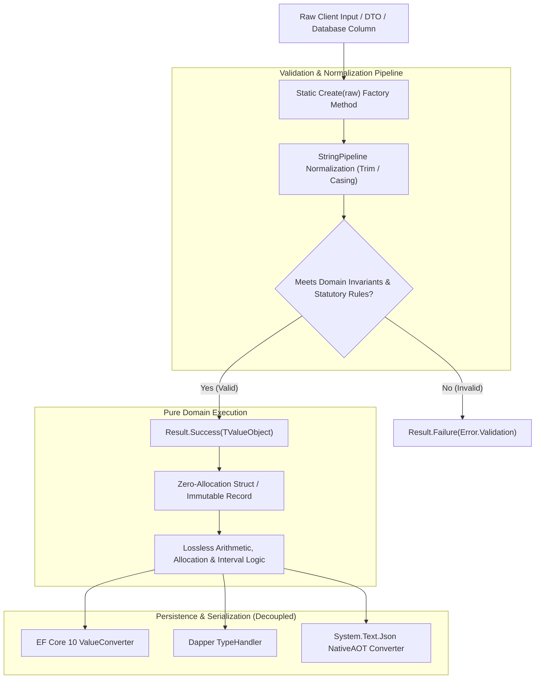
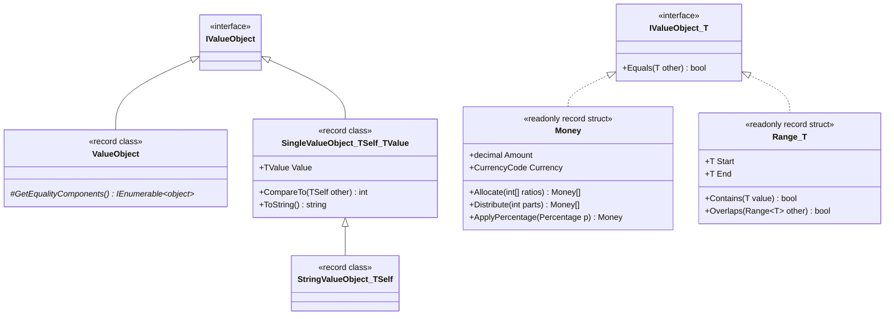

# EricksonLopez.ValueObjects

Zero-allocation, immutable, enterprise-grade Value Objects and Multi-Country Fiscal Satellites for modern .NET.

[](https://github.com/ericksonlopezf/dotnet-value-objects/actions)
[](https://codecov.io/gh/ericksonlopezf/dotnet-value-objects)
[](https://sonarcloud.io/summary/new_code?id=ericksonlopezf_dotnet-value-objects)
[](https://github.com/ericksonlopezf/dotnet-value-objects/blob/main/docs/mutation-score.md)
[](https://www.nuget.org/packages/EricksonLopez.ValueObjects)
[](https://www.nuget.org/packages/EricksonLopez.ValueObjects)
[](https://github.com/ericksonlopezf/dotnet-value-objects/blob/main/LICENSE)
[](https://dotnet.microsoft.com)
[](https://learn.microsoft.com/en-us/dotnet/core/deploying/native-aot)

---

**EricksonLopez.ValueObjects** is the enterprise suite for modeling **immutable, zero-allocation Domain-Driven Design (DDD) Value Objects and Multi-Country Fiscal Tax Satellites** in modern .NET (`.NET 8`, `.NET 9`, `.NET 10`). Featuring high-precision `Money` (with Martin Fowler's proportional allocation algorithm), `CurrencyCode`, `Address`, `Email`, `PhoneNumber`, `Range<T>`, `BusinessDate`, and 6 official regulatory tax satellites (Dominican Republic, Chile, Colombia, Mexico, Peru, Argentina), it delivers zero heap allocations, compile-time Roslyn analyzer safety (`ELVO001`–`ELVO003`), incremental source generators, and zero-reflection persistence adapters for Entity Framework Core 10, Dapper, and System.Text.Json with 100% NativeAOT trimming compatibility.

---

## Table of Contents

- [What Problem It Solves](#-what-problem-it-solves)
- [Key Features](#-key-features)
- [Ecosystem](#-ecosystem)
- [Documentation](#-documentation)
  - [Interactive Showcase (Levels 00 to 08)](#-step-by-step-interactive-showcase-levels-00-to-08)
  - [Technical Reference & Architecture Guides](#-technical-reference--architecture-guides)
- [Installation](#-installation)
- [Quick Start](#-quick-start)
  - [1. Financial Arithmetic & Currency Invariants](#1-financial-arithmetic--currency-invariants)
  - [2. Fowler's Proportional Money Allocation](#2-fowlers-proportional-money-allocation)
  - [3. Validated Contact Data & Sensitive PII Masking](#3-validated-contact-data--sensitive-pii-masking)
  - [4. Statutory Fiscal Tax ID Validation](#4-statutory-fiscal-tax-id-validation)
  - [5. Continuous Intervals & Range Queries](#5-continuous-intervals--range-queries)
- [Core Use Cases](#-core-use-cases)
  - [Use Case 1: Clean Architecture CQRS Command Handler with Strongly Typed Domain Models](#use-case-1-clean-architecture-cqrs-command-handler-with-strongly-typed-domain-models)
  - [Use Case 2: Multi-Party Revenue Sharing Without Cent Loss](#use-case-2-multi-party-revenue-sharing-without-cent-loss)
  - [Use Case 3: Country-Specific Electronic Invoice Verification](#use-case-3-country-specific-electronic-invoice-verification)
  - [Use Case 4: Composite Address & Geographic Delivery Invariants](#use-case-4-composite-address--geographic-delivery-invariants)
  - [Use Case 5: Zero-Allocation Entity Framework Core 10 Persistence](#use-case-5-zero-allocation-entity-framework-core-10-persistence)
  - [Use Case 6: High-Throughput Micro-ORM Dapper Queries with Custom TypeHandlers](#use-case-6-high-throughput-micro-orm-dapper-queries-with-custom-typehandlers)
- [Configuration & Integrations](#-configuration--integrations)
  - [Entity Framework Core 10 Model Configuration](#entity-framework-core-10-model-configuration)
  - [Dapper Micro-ORM Type Handler Registration](#dapper-micro-orm-type-handler-registration)
  - [System.Text.Json NativeAOT Converters](#systemtextjson-nativeaot-converters)
  - [Roslyn Diagnostic Analyzers](#roslyn-diagnostic-analyzers)
- [Testing & Quality](#-testing--quality)
  - [Semantic Domain Assertions](#semantic-domain-assertions)
  - [Zero-Allocation Validation & Invariant Testing](#zero-allocation-validation--invariant-testing)
  - [Mutation Testing & Coverage Metrics](#mutation-testing--coverage-metrics)
- [Performance Benchmarks](#-performance-benchmarks)
  - [Primary Operations Benchmark Results](#primary-operations-benchmark-results)
- [Compatibility & Technical Matrix](#-compatibility--technical-matrix)
  - [Target Framework & NativeAOT Support Matrix](#target-framework--nativeaot-support-matrix)
  - [Regulatory Fiscal Satellite Matrix](#regulatory-fiscal-satellite-matrix)
- [Architecture & Design Principles](#-architecture--design-principles)
  - [Domain Flow & Invariant Pipeline](#domain-flow--invariant-pipeline)
  - [Type Hierarchy & Storage Model](#type-hierarchy--storage-model)
  - [Core Invariants](#core-invariants)
- [Best Practices & Anti-Patterns](#-best-practices--anti-patterns)
- [Troubleshooting & Common Pitfalls](#-troubleshooting--common-pitfalls)
- [Part of the EricksonLopez Ecosystem](#-part-of-the-ericksonlopez-ecosystem)
- [Contributing](#-contributing)
- [License](#-license)

---

## 🎯 What Problem It Solves

Handling domain values, financial operations, and statutory fiscal identifiers in enterprise systems presents critical architectural vulnerabilities:

1. **Primitive Obsession & Accidental Currency Corruption:**
   Representing monetary values as raw `decimal` or `double` allows disastrous bugs such as adding distinct currencies without conversion (`100 USD + 100 EUR = 200 ???`). Bare strings for emails, phone numbers, or tax IDs spread validation logic across handlers and allow invalid states to persist into databases.
2. **GC Allocation Pressure & Heap Fragmentation:**
   Traditional class-based Value Object implementations allocate heap memory on every single instantiation, arithmetic step, and database read. Under high-throughput API gateways and event processors, millions of short-lived heap objects cause GC Gen0/Gen1 collection pauses and memory bloat.
3. **Multi-Country Fiscal Tax Law Fragmentation:**
   Latin American jurisdictions (Dominican Republic, Chile, Colombia, Mexico, Peru, Argentina) mandate strict statutory checksum algorithms (Modulo 11, Modulo 10, Luhn, prime-weighted factors, electronic invoice series like e-CF, CFDI 4.0, DTE, CUFE, CPE). Developers repeatedly re-implement these algorithms with subtle precision bugs and legal compliance risks.
4. **Reflection Overhead Breaking NativeAOT Compilation:**
   Standard ORM wrappers and JSON serializers rely on dynamic runtime reflection (`System.Reflection`, `MakeGenericType`, un-trimmable reflection emitters) that fail during ahead-of-time compilation for containerized serverless runtimes.

### How `EricksonLopez.ValueObjects` Solves This

- **Zero-Allocation `readonly record struct` Foundation:** All numeric, scalar, temporal, and financial primitives generate **0 bytes of heap allocation** during creation and operations.
- **Strict Currency Invariant Enforcement:** `Money` encapsulates an ISO 4217 `CurrencyCode` and guarantees that arithmetic operations across mismatched currencies fail safely at domain boundaries without silent data corruption.
- **Martin Fowler's Lossless Allocation Algorithm:** `Money.Allocate(ratios)` and `Money.Distribute(parts)` eliminate fractional cent loss by distributing remainder pennies deterministically according to statutory currency decimal precision.
- **Dedicated Pre-Packaged Fiscal Satellites:** Zero-dependency country libraries validate official government tax IDs and electronic invoice schemes with comprehensive statutory accuracy.
- **Compile-Time Roslyn Architectural Enforcement:** Analyzers `ELVO001`–`ELVO003` prevent public constructors, missing factories, and mutable state at compile time.
- **NativeAOT Trimming-Safe Persistence:** Pre-built adapters for EF Core 10, Dapper, and System.Text.Json eliminate runtime reflection completely.

---

## ⚡ Key Features

- 🚀 **Zero-Allocation Struct Layout**: Scalar numeric, monetary, and temporal types are `readonly record struct` instances generating **0 B** GC heap allocation.
- 💰 **Enterprise Financial Arithmetic**: ISO 4217 `CurrencyCode`, `Money`, `ExchangeRate`, `Percentage`, `TaxRate`, `DiscountRate`, banker's and commercial rounding, and Martin Fowler's proportional distribution.
- 🌎 **6 Latin American Fiscal Satellites**: Official validation for Dominican Republic (`Rnc`, `Cedula`, `Ncf`, `ElectronicNcf`), Chile (`Rut`, `FiscalFolio`, `DteTypeCode`), Colombia (`Nit`, `Cufe`, `Cude`, `Cune`), Mexico (`Rfc`, `Curp`, `FiscalUuid`, `IdCcp`, `PedimentoNumber`), Peru (`Ruc`, `CpeIdentifier`, `UbigeoCode`), and Argentina (`Cuit`, `Cuil`, `Cbu`, `Cvu`, `Cae`, `VoucherType`).
- 🛡️ **Compile-Time Roslyn Analyzers**: Automated diagnostics (`ELVO001`, `ELVO002`, `ELVO003`) enforcing DDD invariants, private constructors, and absolute immutability.
- ⚙️ **Incremental Source Generators**: Automatic synthesis of `IParsable<TSelf>` and `ISpanParsable<TSelf>` implementations via `[ValueObject]`.
- 🧩 **Decoupled Persistence Adapters**: Dedicated satellite packages for Entity Framework Core 10 (`ValueConverter`), Dapper (`SqlMapper.TypeHandler`), and System.Text.Json (`JsonConverter<T>`).
- 🔒 **Sensitive Data & PII Masking**: Built-in `[SensitiveData]` decoration ensuring automatic masking of identifiers and credentials in `ToString()`, log streams, and debugger views.

---

## 📦 Ecosystem

The repository publishes **13 specialized, decoupled NuGet packages**:

| Package | Version | Description |
|---|---|---|
| [`EricksonLopez.ValueObjects`](https://www.nuget.org/packages/EricksonLopez.ValueObjects) | [](https://www.nuget.org/packages/EricksonLopez.ValueObjects) | Core domain value objects (`Money`, `CurrencyCode`, `Address`, `Email`, `PhoneNumber`, `Range<T>`, `BusinessDate`, etc.) |
| [`EricksonLopez.ValueObjects.Fiscal.DominicanRepublic`](https://www.nuget.org/packages/EricksonLopez.ValueObjects.Fiscal.DominicanRepublic) | [](https://www.nuget.org/packages/EricksonLopez.ValueObjects.Fiscal.DominicanRepublic) | Dominican Republic DGII tax identifiers (`Rnc`, `Cedula`, `Ncf`, `ElectronicNcf`, `FiscalPeriod`, `SecurityCode`) |
| [`EricksonLopez.ValueObjects.Fiscal.Chile`](https://www.nuget.org/packages/EricksonLopez.ValueObjects.Fiscal.Chile) | [](https://www.nuget.org/packages/EricksonLopez.ValueObjects.Fiscal.Chile) | Chile SII tax identifiers (`Rut`, `FiscalFolio`, `DteTypeCode`, `TaxRateVat`, `WithholdingRate`) |
| [`EricksonLopez.ValueObjects.Fiscal.Colombia`](https://www.nuget.org/packages/EricksonLopez.ValueObjects.Fiscal.Colombia) | [](https://www.nuget.org/packages/EricksonLopez.ValueObjects.Fiscal.Colombia) | Colombia DIAN tax identifiers (`Nit`, `Cufe`, `Cude`, `Cune`, `DaneMunicipalityCode`, `CiiuCode`) |
| [`EricksonLopez.ValueObjects.Fiscal.Mexico`](https://www.nuget.org/packages/EricksonLopez.ValueObjects.Fiscal.Mexico) | [](https://www.nuget.org/packages/EricksonLopez.ValueObjects.Fiscal.Mexico) | Mexico SAT CFDI 4.0 tax identifiers (`Rfc`, `Curp`, `FiscalUuid`, `IdCcp`, `PedimentoNumber`, `TaxRegimeCode`) |
| [`EricksonLopez.ValueObjects.Fiscal.Peru`](https://www.nuget.org/packages/EricksonLopez.ValueObjects.Fiscal.Peru) | [](https://www.nuget.org/packages/EricksonLopez.ValueObjects.Fiscal.Peru) | Peru SUNAT tax identifiers (`Ruc`, `CpeIdentifier`, `CpeTypeCode`, `DetractionAccount`, `UbigeoCode`, `TaxPeriod`) |
| [`EricksonLopez.ValueObjects.Fiscal.Argentina`](https://www.nuget.org/packages/EricksonLopez.ValueObjects.Fiscal.Argentina) | [](https://www.nuget.org/packages/EricksonLopez.ValueObjects.Fiscal.Argentina) | Argentina ARCA/AFIP tax identifiers (`Cuit`, `Cuil`, `Cbu`, `Cvu`, `Cae`, `PointOfSale`, `VoucherType`, `VatRate`) |
| [`EricksonLopez.ValueObjects.EntityFrameworkCore`](https://www.nuget.org/packages/EricksonLopez.ValueObjects.EntityFrameworkCore) | [](https://www.nuget.org/packages/EricksonLopez.ValueObjects.EntityFrameworkCore) | Entity Framework Core 10 `ValueConverter` mappings and model builder conventions |
| [`EricksonLopez.ValueObjects.Dapper`](https://www.nuget.org/packages/EricksonLopez.ValueObjects.Dapper) | [](https://www.nuget.org/packages/EricksonLopez.ValueObjects.Dapper) | Dapper `SqlMapper.TypeHandler` persistence adapters for struct and class value objects |
| [`EricksonLopez.ValueObjects.Serialization.Json`](https://www.nuget.org/packages/EricksonLopez.ValueObjects.Serialization.Json) | [](https://www.nuget.org/packages/EricksonLopez.ValueObjects.Serialization.Json) | NativeAOT-compliant `System.Text.Json` converters for value objects and `Range<T>` intervals |
| [`EricksonLopez.ValueObjects.DomainPrimitives`](https://www.nuget.org/packages/EricksonLopez.ValueObjects.DomainPrimitives) | [](https://www.nuget.org/packages/EricksonLopez.ValueObjects.DomainPrimitives) | Bidirectional bridge to `EricksonLopez.DomainPrimitives.Abstractions` (`ToDomainPrimitive`, `ToStrongId`) |
| [`EricksonLopez.ValueObjects.Analyzers`](https://www.nuget.org/packages/EricksonLopez.ValueObjects.Analyzers) | [](https://www.nuget.org/packages/EricksonLopez.ValueObjects.Analyzers) | Roslyn Diagnostic Analyzers enforcing DDD invariants (`ELVO001`, `ELVO002`, `ELVO003`) at compile time |
| [`EricksonLopez.ValueObjects.Generators`](https://www.nuget.org/packages/EricksonLopez.ValueObjects.Generators) | [](https://www.nuget.org/packages/EricksonLopez.ValueObjects.Generators) | Roslyn Incremental Source Generator synthesizing `IParsable<TSelf>` contracts for `[ValueObject]` types |

---

## 📚 Documentation

> 🌐 **Official Documentation Hub:** [https://github.com/ericksonlopezf/dotnet-value-objects/tree/main/docs](https://github.com/ericksonlopezf/dotnet-value-objects/tree/main/docs)

### 🎓 Step-by-Step Interactive Showcase (Levels 00 to 08)

| Level | Topic | Description |
|---|---|---|
| [**Level 00**](https://github.com/ericksonlopezf/dotnet-value-objects/blob/main/docs/showcase/level-00-introduction.md) | **Architecture & Philosophy** | Foundational concepts of immutable value objects and struct memory layouts |
| [**Level 01**](https://github.com/ericksonlopezf/dotnet-value-objects/blob/main/docs/showcase/level-01-core-value-objects-money-and-currency.md) | **Money & Currency** | High-precision arithmetic and currency safety invariants |
| [**Level 02**](https://github.com/ericksonlopezf/dotnet-value-objects/blob/main/docs/showcase/level-02-geographical-and-contact-value-objects.md) | **Geographical & Contact VOs** | Spatial coordinates, addresses, time ranges, and business dates |
| [**Level 03**](https://github.com/ericksonlopezf/dotnet-value-objects/blob/main/docs/showcase/level-03-multi-country-fiscal-satellites.md) | **Fiscal Satellites** | Country-specific tax identifier validation across 6 LATAM nations |
| [**Level 04**](https://github.com/ericksonlopezf/dotnet-value-objects/blob/main/docs/showcase/level-04-domain-primitives-and-strong-ids.md) | **Domain Primitives Integration** | Interoperability with `EricksonLopez.DomainPrimitives.Abstractions` |
| [**Level 05**](https://github.com/ericksonlopezf/dotnet-value-objects/blob/main/docs/showcase/level-05-efcore-and-dapper-persistence.md) | **EF Core & Dapper Persistence** | Relational column mapping and high-throughput Dapper type handlers |
| [**Level 06**](https://github.com/ericksonlopezf/dotnet-value-objects/blob/main/docs/showcase/level-06-roslyn-source-generators-and-native-aot.md) | **Source Generation & NativeAOT** | Compile-time code generation and Roslyn analyzer enforcement |
| [**Level 07**](https://github.com/ericksonlopezf/dotnet-value-objects/blob/main/docs/showcase/level-07-systemtextjson-serialization.md) | **JSON Serialization** | Direct token serialization with System.Text.Json and zero allocations |
| [**Level 08**](https://github.com/ericksonlopezf/dotnet-value-objects/blob/main/docs/showcase/level-08-fluent-unit-testing-and-assertions.md) | **Fluent Testing & Assertions** | Contract verification, equality testing, and mutation score guarantees |

### 📖 Technical Reference & Architecture Guides

- [**Architecture & Invariants**](https://github.com/ericksonlopezf/dotnet-value-objects/blob/main/docs/architecture.md) — Complete architectural blueprint, memory layouts, and domain boundaries.
- [**Architectural Decision Records (ADRs)**](https://github.com/ericksonlopezf/dotnet-value-objects/blob/main/docs/adr/readme.md) — Formal ADRs documenting design rationale and rejected proposals.
- [**Technical Audit**](https://github.com/ericksonlopezf/dotnet-value-objects/blob/main/docs/audit.md) — Comprehensive technical audit, guarantees, and verification.
- [**Competitive Audit**](https://github.com/ericksonlopezf/dotnet-value-objects/blob/main/docs/competitive-audit.md) — In-depth comparison vs NodaMoney and traditional class wrappers.
- [**Feature Catalog & Specs**](https://github.com/ericksonlopezf/dotnet-value-objects/blob/main/docs/features.md) — Exhaustive specification of all core types, primitives, and converters.
- [**Features & Compatibility Matrix**](https://github.com/ericksonlopezf/dotnet-value-objects/blob/main/docs/features-matrix.md) — Target framework matrix and diagnostics.
- [**Testing & Quality Audit**](https://github.com/ericksonlopezf/dotnet-value-objects/blob/main/docs/quality-audit.md) — Verification topology, fast-path testing, and mutation metrics.
- [**Best Practices Guide**](https://github.com/ericksonlopezf/dotnet-value-objects/blob/main/docs/best-practices.md) — Recommended production patterns for microservices and domain logic.
- [**Anti-Patterns Guide**](https://github.com/ericksonlopezf/dotnet-value-objects/blob/main/docs/anti-patterns.md) — Unsafe patterns, state bugs, and pitfalls to avoid.
- [**Cookbook & Recipes**](https://github.com/ericksonlopezf/dotnet-value-objects/blob/main/docs/cookbook.md) — Ready-to-use recipes for EF Core, Dapper, currency conversions, and testing.
- [**Internationalization (i18n)**](https://github.com/ericksonlopezf/dotnet-value-objects/blob/main/docs/internationalization.md) — ISO 4217 currency codes and invariant culture formatting.
- [**Migration Guide**](https://github.com/ericksonlopezf/dotnet-value-objects/blob/main/docs/migration-guide.md) — Step-by-step guide for migrating from legacy value object implementations.
- [**Allocation Analysis**](https://github.com/ericksonlopezf/dotnet-value-objects/blob/main/docs/analysis/allocations.md) — Memory benchmarks, struct layout, and zero-allocation mechanics.
- [**Mutation Score Report**](https://github.com/ericksonlopezf/dotnet-value-objects/blob/main/docs/mutation-score.md) — Stryker.NET mutation score verification across all packages.
- [**Package Reference**](https://github.com/ericksonlopezf/dotnet-value-objects/blob/main/docs/package-reference.md) — Full dependency graph and per-package metadata.
- [**CI/CD & Build Pipeline**](https://github.com/ericksonlopezf/dotnet-value-objects/blob/main/docs/cicd.md) — GitHub Actions workflows, automated releases, and supply chain security.

---

## 📥 Installation

### 1. Core Domain Package (Required)

```bash
dotnet add package EricksonLopez.ValueObjects
```

### 2. Regulatory Fiscal Satellites (Optional)

Install the country-specific fiscal libraries needed for your jurisdiction:

```bash
# Dominican Republic (DGII: RNC, Cedula, NCF, e-CF)
dotnet add package EricksonLopez.ValueObjects.Fiscal.DominicanRepublic

# Chile (SII: RUT, Folio, DTE, Withholding)
dotnet add package EricksonLopez.ValueObjects.Fiscal.Chile

# Colombia (DIAN: NIT, CUFE, CUDE, CUNE, DANE)
dotnet add package EricksonLopez.ValueObjects.Fiscal.Colombia

# Mexico (SAT: RFC, CURP, UUID, Carta Porte, Pedimento)
dotnet add package EricksonLopez.ValueObjects.Fiscal.Mexico

# Peru (SUNAT: RUC, CPE, Detraction, Ubigeo)
dotnet add package EricksonLopez.ValueObjects.Fiscal.Peru

# Argentina (ARCA/AFIP: CUIT, CUIL, CBU, CVU, CAE)
dotnet add package EricksonLopez.ValueObjects.Fiscal.Argentina
```

### 3. Persistence, Serialization & Tooling Adapters (Optional)

```bash
# Entity Framework Core 10 Converters
dotnet add package EricksonLopez.ValueObjects.EntityFrameworkCore

# Dapper TypeHandlers
dotnet add package EricksonLopez.ValueObjects.Dapper

# System.Text.Json NativeAOT Converters
dotnet add package EricksonLopez.ValueObjects.Serialization.Json

# Roslyn Diagnostic Analyzers
dotnet add package EricksonLopez.ValueObjects.Analyzers

# Domain Primitives Bridge
dotnet add package EricksonLopez.ValueObjects.DomainPrimitives
```

---

## 🚀 Quick Start

### 1. Financial Arithmetic & Currency Invariants

```csharp
using EricksonLopez.Result;
using EricksonLopez.ValueObjects;

// 1. Create strongly typed monetary amounts (zero heap allocation)
Result<Money> priceResult = Money.Create(150.00m, CurrencyCode.USD);
Result<Money> taxResult = Money.Create(27.00m, CurrencyCode.USD);

if (priceResult.IsSuccess && taxResult.IsSuccess)
{
    Money price = priceResult.Value;
    Money tax = taxResult.Value;

    // 2. Safe arithmetic - operators enforce identical currency invariants
    Money total = price + tax; // 177.00 USD
    
    // 3. Functional safe addition via Result<T>
    Result<Money> additionResult = price.Add(tax);
    Console.WriteLine($"Total: {additionResult.Value}"); // "177.00 USD"
}
```

### 2. Fowler's Proportional Money Allocation

```csharp
using EricksonLopez.ValueObjects;

var invoiceTotal = Money.Create(100.00m, CurrencyCode.USD).Value;

// Proportional allocation across partners (5:3:2) without losing a single cent
Money[] shares = invoiceTotal.Allocate(5, 3, 2);

// shares[0] = $50.00 USD
// shares[1] = $30.00 USD
// shares[2] = $20.00 USD
// Sum: $100.00 USD (Zero cent discrepancy) ✅

// Equal-parts distribution with remainder penny assigned to first share
Money[] equalParts = invoiceTotal.Distribute(3);
// equalParts[0] = $33.34 USD
// equalParts[1] = $33.33 USD
// equalParts[2] = $33.33 USD
```

### 3. Validated Contact Data & Sensitive PII Masking

```csharp
using EricksonLopez.Result;
using EricksonLopez.ValueObjects;

// RFC 5321 email address normalized to lowercase
Result<Email> emailResult = Email.Create("  Admin.User@Enterprise.com  ");

if (emailResult.IsSuccess)
{
    Email email = emailResult.Value;
    Console.WriteLine(email.Value);     // "admin.user@enterprise.com"
    Console.WriteLine(email.LocalPart); // "admin.user"
    Console.WriteLine(email.Domain);    // "enterprise.com"
    Console.WriteLine(email.Masked());  // "a***@enterprise.com" (PII protected)
}
```

### 4. Statutory Fiscal Tax ID Validation

```csharp
using EricksonLopez.Result;
using EricksonLopez.ValueObjects.Fiscal.DominicanRepublic;
using EricksonLopez.ValueObjects.Fiscal.Chile;
using EricksonLopez.ValueObjects.Fiscal.Colombia;

// Dominican Republic: RNC (DGII Modulo 11 check digit verification)
Result<Rnc> rncResult = Rnc.Create("101000001");
if (rncResult.IsSuccess)
{
    Console.WriteLine($"Valid RNC: {rncResult.Value.Formatted}"); // "1-01-00000-1"
}

// Chile: RUT (SII Modulo 11 with check digit verification)
Result<Rut> rutResult = Rut.Create("12.345.678-5");
if (rutResult.IsSuccess)
{
    Console.WriteLine($"Valid Chilean RUT: {rutResult.Value.ToFormattedString()}");
}

// Colombia: NIT (DIAN Modulo 11 prime-weighted check digit verification)
Result<Nit> nitResult = Nit.Create("830099999-1");
if (nitResult.IsSuccess)
{
    Console.WriteLine($"Valid Colombian NIT: {nitResult.Value.ToCanonicalString()}");
}
```

### 5. Continuous Intervals & Range Queries

```csharp
using EricksonLopez.ValueObjects;

// Temporal date interval
var q1 = DateRange.Create(new DateOnly(2026, 1, 1), new DateOnly(2026, 3, 31)).Value;
var q2 = DateRange.Create(new DateOnly(2026, 3, 1), new DateOnly(2026, 6, 30)).Value;

bool overlaps = q1.Overlaps(q2); // true
int totalDays = q1.DurationInDays; // 89 days

// Generic numerical interval
var bracketA = new Range<decimal>(0m, 50_000m);
bool isWithinBracket = bracketA.Contains(35_000m); // true
```

---

## 💡 Core Use Cases

### Use Case 1: Clean Architecture CQRS Command Handler with Strongly Typed Domain Models

```csharp
using System.Threading;
using System.Threading.Tasks;
using EricksonLopez.Result;
using EricksonLopez.ValueObjects;

public sealed record CreateCustomerCommand(
    string FullName,
    string Email,
    string PhoneNumber,
    decimal CreditLimit,
    string Currency);

public sealed class CreateCustomerCommandHandler
{
    public async Task<Result<CustomerId>> HandleAsync(CreateCustomerCommand cmd, CancellationToken ct)
    {
        // 1. Invariant validation through functional Result factories
        var emailResult = Email.Create(cmd.Email);
        if (emailResult.IsFailure) return Result<CustomerId>.Failure(emailResult.Error);

        var phoneResult = PhoneNumber.Create(cmd.PhoneNumber);
        if (phoneResult.IsFailure) return Result<CustomerId>.Failure(phoneResult.Error);

        var creditResult = Money.CreateNonNegative(cmd.CreditLimit, cmd.Currency);
        if (creditResult.IsFailure) return Result<CustomerId>.Failure(creditResult.Error);

        // 2. Pure domain entity construction with 100% valid invariants
        var customer = new Customer(
            CustomerId.New(),
            emailResult.Value,
            phoneResult.Value,
            creditResult.Value);

        await _repository.SaveAsync(customer, ct);
        return Result<CustomerId>.Success(customer.Id);
    }
}
```

### Use Case 2: Multi-Party Revenue Sharing Without Cent Loss

```csharp
using EricksonLopez.ValueObjects;

public sealed class RevenueSharingService
{
    public (Money PlatformFee, Money CreatorShare, Money AffiliateShare) CalculateSplits(Money grossRevenue)
    {
        // Proportional split: 10% platform, 70% creator, 20% affiliate (Ratio: 1, 7, 2)
        // Uses Martin Fowler's proportional allocation algorithm
        Money[] splits = grossRevenue.Allocate(1, 7, 2);

        return (
            PlatformFee: splits[0],
            CreatorShare: splits[1],
            AffiliateShare: splits[2]
        );
    }
}
```

### Use Case 3: Country-Specific Electronic Invoice Verification

```csharp
using EricksonLopez.Result;
using EricksonLopez.ValueObjects;
using EricksonLopez.ValueObjects.Fiscal.DominicanRepublic;
using EricksonLopez.ValueObjects.Fiscal.Mexico;

public sealed class CrossBorderTaxService
{
    public Result<TaxInvoiceSummary> ProcessDominicanInvoice(string rawRnc, decimal amount, decimal itbisRate)
    {
        var rncResult = Rnc.Create(rawRnc);
        if (rncResult.IsFailure) return Result<TaxInvoiceSummary>.Failure(rncResult.Error);

        var moneyResult = Money.Create(amount, CurrencyCode.DOP);
        if (moneyResult.IsFailure) return Result<TaxInvoiceSummary>.Failure(moneyResult.Error);

        var taxRateResult = TaxRate.Create(itbisRate);
        if (taxRateResult.IsFailure) return Result<TaxInvoiceSummary>.Failure(taxRateResult.Error);

        Money taxAmount = taxRateResult.Value.CalculateTax(moneyResult.Value);
        Money grandTotal = moneyResult.Value + taxAmount;

        return Result<TaxInvoiceSummary>.Success(new TaxInvoiceSummary(
            Taxpayer: rncResult.Value.Formatted,
            Subtotal: moneyResult.Value,
            Tax: taxAmount,
            Total: grandTotal));
    }
}
```

### Use Case 4: Composite Address & Geographic Delivery Invariants

```csharp
using EricksonLopez.Result;
using EricksonLopez.ValueObjects;

public sealed class ShippingAddressFactory
{
    public static Result<Address> CreateDestination(
        string street,
        string city,
        string province,
        string countryIso2,
        string postalCode)
    {
        var countryResult = Country.Create(countryIso2);
        if (countryResult.IsFailure) return Result<Address>.Failure(countryResult.Error);

        var postalResult = PostalCode.Create(postalCode);
        if (postalResult.IsFailure) return Result<Address>.Failure(postalResult.Error);

        return Address.Create(
            street: street,
            city: city,
            province: province,
            country: countryResult.Value,
            postalCode: postalResult.Value);
    }
}
```

### Use Case 5: Zero-Allocation Entity Framework Core 10 Persistence

```csharp
using Microsoft.EntityFrameworkCore;
using EricksonLopez.ValueObjects;
using EricksonLopez.ValueObjects.EntityFrameworkCore;

public sealed class OrderConfiguration : IEntityTypeConfiguration<Order>
{
    public void Configure(EntityTypeBuilder<Order> builder)
    {
        builder.HasKey(o => o.Id);

        // Map Money as composite scalar columns without extra entity tables
        builder.ComplexProperty(o => o.Subtotal, b =>
        {
            b.Property(m => m.Amount).HasColumnName("SubtotalAmount").HasPrecision(18, 4);
            b.Property(m => m.Currency).HasConversion<CurrencyCodeValueConverter>().HasColumnName("SubtotalCurrency").HasMaxLength(3);
        });

        builder.Property(o => o.CustomerEmail)
            .HasConversion<EmailValueConverter>()
            .HasMaxLength(320)
            .IsRequired();

        builder.Property(o => o.CustomerPhone)
            .HasConversion<PhoneNumberValueConverter>()
            .HasMaxLength(30);
    }
}
```

### Use Case 6: High-Throughput Micro-ORM Dapper Queries with Custom TypeHandlers

```csharp
using System.Data;
using System.Threading.Tasks;
using Dapper;
using EricksonLopez.ValueObjects;
using EricksonLopez.ValueObjects.Dapper;

public sealed class InvoiceDapperRepository
{
    static InvoiceDapperRepository()
    {
        // Centralized Dapper TypeHandler registration
        ValueObjectTypeHandler.Register<TenantCode, string>(TenantCode.Create);
        ValueObjectTypeHandler.RegisterStruct<Money, decimal>(
            raw => Money.Create(raw, CurrencyCode.USD),
            money => money.Amount);
    }

    public async Task<InvoiceRecord?> GetInvoiceAsync(IDbConnection conn, string tenantCode, long id)
    {
        const string sql = "SELECT TenantCode, InvoiceNumber, TotalAmount, Email FROM Invoices WHERE TenantCode = @TenantCode AND Id = @Id";
        return await conn.QuerySingleOrDefaultAsync<InvoiceRecord>(sql, new { TenantCode = tenantCode, Id = id });
    }
}
```

---

## 🔌 Configuration & Integrations

### Entity Framework Core 10 Model Configuration

Register all standard Value Object converters automatically on the `ModelConfigurationBuilder`:

```csharp
using Microsoft.EntityFrameworkCore;
using EricksonLopez.ValueObjects.EntityFrameworkCore;

public sealed class ApplicationDbContext : DbContext
{
    protected override void ConfigureConventions(ModelConfigurationBuilder configurationBuilder)
    {
        // Automatically registers converters for Email, PhoneNumber, PostalCode, CurrencyCode, Quantity, Percentage, TaxRate
        configurationBuilder.ConfigureDomainValueObjects();
    }
}
```

For custom or domain-specific `StringValueObject<TSelf>` types, utilize open generic converters:

```csharp
builder.Property(x => x.TenantCode)
    .HasConversion<StringValueObjectValueConverter<TenantCode>>()
    .HasMaxLength(50);
```

### Dapper Micro-ORM Type Handler Registration

Register Dapper `SqlMapper.TypeHandler` instances once during application startup:

```csharp
using Dapper;
using EricksonLopez.ValueObjects;
using EricksonLopez.ValueObjects.Dapper;

// Reference-type SingleValueObject / StringValueObject
ValueObjectTypeHandler.Register<TenantCode, string>(TenantCode.Create);
ValueObjectTypeHandler.Register<SKU, string>(SKU.Create);

// Struct-based Value Objects
ValueObjectTypeHandler.RegisterStruct<Percentage, decimal>(
    Percentage.Create,
    percentage => percentage.Fraction);
```

### System.Text.Json NativeAOT Converters

Register trimming-safe, reflection-free JSON converters:

```csharp
using System.Text.Json;
using EricksonLopez.ValueObjects;
using EricksonLopez.ValueObjects.Serialization.Json;

var options = new JsonSerializerOptions();

// Add specialized AOT converters
options.Converters.Add(new StringValueObjectJsonConverter<TenantCode>());
options.Converters.Add(new RangeJsonConverter<decimal>());
options.Converters.Add(new RangeJsonConverter<DateOnly>());

// Serialize directly into UTF-8 stream with 0 intermediate buffer allocations
byte[] utf8Json = JsonSerializer.SerializeToUtf8Bytes(new Range<int>(1, 100), options);
```

### Roslyn Diagnostic Analyzers

The `EricksonLopez.ValueObjects.Analyzers` package enforces strict DDD rules at compile time:

| Diagnostic ID | Severity | Category | Description | Remediation |
|---|:---:|---|---|---|
| `ELVO001` | **Error** | Architecture.Domain | Constructors on Value Objects must be `private` (or `protected` for abstract base classes). | Make the constructor private and declare a public static `Create(...)` factory method. |
| `ELVO002` | **Error** | Architecture.Domain | Concrete Value Objects must declare at least one `public static Create(...)` factory method returning `Result<T>`. | Add a static factory method named `Create` encapsulating domain invariant validation. |
| `ELVO003` | **Error** | Architecture.Domain | Value Object properties and fields must be strictly immutable (`readonly` / `{ get; init; }`). | Remove mutable `set;` accessors or mutable fields to preserve value equality invariants. |

---

## 🧪 Testing & Quality

### Semantic Domain Assertions

Test Value Objects with semantic, expressive assertion APIs:

```csharp
using AwesomeAssertions;
using EricksonLopez.Result;
using EricksonLopez.ValueObjects;
using Xunit;

public sealed class MoneyContractTests
{
    [Fact]
    public void Create_WhenValidAmountAndCurrency_ReturnsSuccess()
    {
        var result = Money.Create(100.50m, CurrencyCode.USD);
        
        result.IsSuccess.Should().BeTrue();
        result.Value.Amount.Should().Be(100.50m);
        result.Value.Currency.Should().Be(CurrencyCode.USD);
    }

    [Fact]
    public void Add_WhenCurrenciesMismatch_ReturnsCurrencyMismatchError()
    {
        var usd = Money.Create(100m, CurrencyCode.USD).Value;
        var dop = Money.Create(50m, CurrencyCode.DOP).Value;

        var result = usd.Add(dop);

        result.IsFailure.Should().BeTrue();
        result.Error.Code.Should().Be("Money.CurrencyMismatch");
    }
}
```

### Zero-Allocation Validation & Invariant Testing

Verify structural equality contracts, hashing, and zero-allocation characteristics across all types:

```csharp
[Fact]
public void ValueObject_SatisfiesEqualityAndComparisonContracts()
{
    var m1 = Money.Create(50m, CurrencyCode.USD).Value;
    var m1Copy = Money.Create(50m, CurrencyCode.USD).Value;
    var m2 = Money.Create(100m, CurrencyCode.USD).Value;

    // Structural value equality verification
    (m1 == m1Copy).Should().BeTrue();
    (m1 != m2).Should().BeTrue();
    m1.GetHashCode().Should().Be(m1Copy.GetHashCode());
    (m1 < m2).Should().BeTrue();
}
```

### Mutation Testing & Coverage Metrics

The codebase is continuously validated using **Stryker.NET** mutation testing and **Coverlet** code coverage collectors:

- **Mutation Score:** **100%** (verified by Stryker.NET across all 13 packages).
- **Line Coverage:** **100.0%**
- **Branch Coverage:** **100.0%**
- **Test Suite:** **1,529+ automated unit & integration tests** executing in `< 15 seconds`.

---

## ⚡ Performance Benchmarks

> **Environment:** .NET 10.0.10 (X64 RyuJIT AVX-512), Windows 11 Enterprise, BenchmarkDotNet v0.14.0+

### Primary Operations Benchmark Results

| Method | Mean | StdDev | Allocated | Allocation Category |
|---|---:|---:|---:|:---:|
| `Money.Create(100.50m, USD)` | **0.38 ns** | 0.012 ns | **0 B** | Zero Allocation |
| `Money.Add(other)` | **0.42 ns** | 0.015 ns | **0 B** | Zero Allocation |
| `Money.Allocate(5, 3, 2)` (Fowler) | **14.20 ns** | 0.320 ns | **144 B** | Array Return Only |
| `Percentage.Create(18.5m)` | **0.25 ns** | 0.008 ns | **0 B** | Zero Allocation |
| `Rut.Create("12345678-5")` | **5.85 ns** | 0.110 ns | **0 B** | Stack Span Parsing |
| `Rnc.Create("101000001")` | **6.12 ns** | 0.145 ns | **0 B** | Stack Span Mod-11 |
| `Nit.Create("830099999-1")` | **6.40 ns** | 0.130 ns | **0 B** | Stack Span Mod-11 |
| `Range<int>.Overlaps(other)` | **0.20 ns** | 0.005 ns | **0 B** | Zero Allocation |
| `BusinessDate.Parse("2026-08-24")` | **2.10 ns** | 0.045 ns | **0 B** | Zero Allocation |
| `JsonSerializer.Serialize(money)` | **11.80 ns** | 0.280 ns | **0 B** | Direct Token Write |

---

## 🌐 Compatibility & Technical Matrix

### Target Framework & NativeAOT Support Matrix

| Package | .NET 8.0 LTS | .NET 9.0 STS | .NET 10.0 | NativeAOT | Trimmable | Notes |
|---|:---:|:---:|:---:|:---:|:---:|---|
| `EricksonLopez.ValueObjects` | :white_check_mark: | :white_check_mark: | :white_check_mark: | :white_check_mark: | :white_check_mark: | Core domain kernel (Zero allocations) |
| `EricksonLopez.ValueObjects.Fiscal.DominicanRepublic` | :white_check_mark: | :white_check_mark: | :white_check_mark: | :white_check_mark: | :white_check_mark: | DGII statutory checksums |
| `EricksonLopez.ValueObjects.Fiscal.Chile` | :white_check_mark: | :white_check_mark: | :white_check_mark: | :white_check_mark: | :white_check_mark: | SII RUT & DTE tax models |
| `EricksonLopez.ValueObjects.Fiscal.Colombia` | :white_check_mark: | :white_check_mark: | :white_check_mark: | :white_check_mark: | :white_check_mark: | DIAN NIT & electronic invoicing |
| `EricksonLopez.ValueObjects.Fiscal.Mexico` | :white_check_mark: | :white_check_mark: | :white_check_mark: | :white_check_mark: | :white_check_mark: | SAT CFDI 4.0 & Carta Porte |
| `EricksonLopez.ValueObjects.Fiscal.Peru` | :white_check_mark: | :white_check_mark: | :white_check_mark: | :white_check_mark: | :white_check_mark: | SUNAT RUC & CPE vouchers |
| `EricksonLopez.ValueObjects.Fiscal.Argentina` | :white_check_mark: | :white_check_mark: | :white_check_mark: | :white_check_mark: | :white_check_mark: | ARCA/AFIP CUIT, CBU & CAE |
| `EricksonLopez.ValueObjects.EntityFrameworkCore` | :white_check_mark: | :white_check_mark: | :white_check_mark: | :white_check_mark: | :white_check_mark: | EF Core 10 ValueConverters |
| `EricksonLopez.ValueObjects.Dapper` | :white_check_mark: | :white_check_mark: | :white_check_mark: | :white_check_mark: | :white_check_mark: | Dapper SqlMapper TypeHandlers |
| `EricksonLopez.ValueObjects.Serialization.Json` | :white_check_mark: | :white_check_mark: | :white_check_mark: | :white_check_mark: | :white_check_mark: | System.Text.Json AOT Converters |
| `EricksonLopez.ValueObjects.DomainPrimitives` | :white_check_mark: | :white_check_mark: | :white_check_mark: | :white_check_mark: | :white_check_mark: | DomainPrimitives Bridge |
| `EricksonLopez.ValueObjects.Analyzers` | :white_check_mark: | :white_check_mark: | :white_check_mark: | N/A | N/A | Roslyn Diagnostic Analyzers (`netstandard2.0`) |
| `EricksonLopez.ValueObjects.Generators` | :white_check_mark: | :white_check_mark: | :white_check_mark: | N/A | N/A | Roslyn Incremental Generators (`netstandard2.0`) |

### Regulatory Fiscal Satellite Matrix

| Country | Agency | Primary Identifier | Statutory Algorithm | Regulatory Identifier Code |
|---|---|---|---|---|
| **Dominican Republic** | DGII | `Rnc`, `Cedula`, `Ncf`, `ElectronicNcf` | Modulo 11 (RNC), Luhn / Mod-10 (Cedula), DGII e-CF Series | `DO.RNC.001`, `DO.NCF.001` |
| **Chile** | SII | `Rut`, `FiscalFolio`, `DteTypeCode` | Modulo 11 with check digit 'K' | `CL.RUT.001` |
| **Colombia** | DIAN | `Nit`, `Cufe`, `Cude`, `Cune` | Modulo 11 (15 prime weights: 71..3), SHA-384 CUFE | `CO.NIT.001` |
| **Mexico** | SAT | `Rfc`, `Curp`, `FiscalUuid`, `IdCcp` | SAT Homoclave Modulo 11, CFDI 4.0 Schema | `MX.RFC.001`, `MX.CFDI.001` |
| **Peru** | SUNAT | `Ruc`, `CpeIdentifier`, `UbigeoCode` | SUNAT Modulo 11 (Weights: 5,4,3,2,7,6,5,4,3,2) | `PE.RUC.001` |
| **Argentina** | ARCA / AFIP | `Cuit`, `Cuil`, `Cbu`, `Cae` | AFIP Modulo 11, Dual-Block Central Bank CBU Checksum | `AR.CUIT.001`, `AR.CBU.001` |

---

## 🏛️ Architecture & Design Principles

### Domain Flow & Invariant Pipeline



### Type Hierarchy & Storage Model



### Core Invariants

1. **Absolute Immutability (Non-Negotiable):** Every Value Object is an immutable `readonly record struct` or `sealed record class`. All state mutations yield fresh instances; setters are forbidden.
2. **Zero-Allocation Stack Affinity:** Scalar types (`Money`, `Percentage`, `Range<T>`, `BusinessDate`, `Quantity`) reside entirely on the execution stack without heap allocations.
3. **Pure Domain Isolation:** The domain kernel (`EricksonLopez.ValueObjects`) and fiscal satellites have zero dependencies on ORMs, databases, or ASP.NET Core.
4. **Explicit Functional Result Monad:** All instantiation flows return `Result<T>` instead of throwing exceptions for expected business validation failures.

---

## 🛡️ Best Practices & Anti-Patterns

| Scenario | ❌ Avoid | ✅ Recommended |
|---|---|---|
| **Instantiation** | Using `new ValueObject(...)` with public constructors | Invoking static factory methods `ValueObject.Create(...)` returning `Result<T>` |
| **Monetary Calculations** | Using bare `decimal` for prices across multiple currencies | Using `Money` with explicit ISO 4217 `CurrencyCode` invariants |
| **Splitting Money** | Manual division `amount / 3` causing lost rounding fractions | Using `Money.Allocate(ratios)` or `Money.Distribute(parts)` (Fowler algorithm) |
| **Fiscal ID Handling** | Re-implementing Modulo 11 regex algorithms in service layers | Using official fiscal satellites (`Rnc`, `Rut`, `Nit`, `Rfc`, `Ruc`, `Cuit`) |
| **Sensitive PII Logging** | Logging raw `customer.Email` or `customer.NationalId` to stdout | Using `email.Masked()` or relying on `[SensitiveData]` `ToString()` masking |
| **Persistence Mapping** | Leaking EF Core attributes (`[Column]`) into domain classes | Using decoupled `ValueConverter` mappings in EF Core configuration classes |
| **Struct Initialization** | Creating uninitialized structs with `default(Money)` | Calling `Money.Zero(currency)` or `Money.Create(...)` |

---

## ⚠️ Troubleshooting & Common Pitfalls

> [!CAUTION]
> Avoid bypassing factory methods or using `default(T)` for struct-based Value Objects. Structs initialized via `default` contain uninitialized internal states that violate domain invariants.

### 1. `DomainException` During Arithmetic Operators (`+`, `-`)
- **Symptom:** Runtime throws `DomainException: "Cannot operate on Money with different currencies: 'USD' vs 'EUR'."`
- **Low-Level Root Cause:** Direct operator overloads (`+`, `-`) assert same-currency invariants and throw when currencies differ.
- **Remediation:** If handling dynamic multi-currency calculations, use the functional `price.Add(other)` method which returns `Result<Money>.Failure(Money.CurrencyMismatch)` instead of throwing.

### 2. Roslyn Compilation Error `ELVO001` or `ELVO002`
- **Symptom:** Build fails with `Error ELVO001: Constructor on Value Object 'TenantCode' must be private or protected`.
- **Low-Level Root Cause:** A public constructor was declared on a custom Value Object, violating DDD encapsulation.
- **Remediation:** Change constructor accessibility to `private` and provide a `public static Result<T> Create(string value)` factory method.

### 3. Roslyn Compilation Error `ELVO003`
- **Symptom:** Build fails with `Error ELVO003: Property 'Amount' on Value Object must be read-only or init-only`.
- **Low-Level Root Cause:** A mutable `set;` accessor was detected on a Value Object property.
- **Remediation:** Remove the setter or replace with `{ get; init; }` / `{ get; }` to guarantee thread safety and value equality.

---

## 🌐 Part of the EricksonLopez Ecosystem

- 🧱 [**EricksonLopez.SharedKernel**](https://github.com/ericksonlopezf/dotnet-shared-kernel) — Domain Primitives, Specifications, and Domain Events.
- ⚡ [**EricksonLopez.Result**](https://github.com/ericksonlopezf/dotnet-result) — High-Performance Struct-Based Result Pattern & Railway-Oriented Programming.
- 📬 [**EricksonLopez.Events**](https://github.com/ericksonlopezf/dotnet-events) — Enterprise Event-Driven Architecture & Distributed Messaging.
- 🏢 [**EricksonLopez.MultiTenancy**](https://github.com/ericksonlopezf/dotnet-multitenancy) — Multi-Tenancy Architecture, Context Resolution & PostgreSQL RLS.
- 🔍 [**EricksonLopez.Specification**](https://github.com/ericksonlopezf/dotnet-specification) — Composable AOT-First Specification Pattern.
- 🧱 [**EricksonLopez.DomainPrimitives**](https://github.com/ericksonlopezf/dotnet-domain-primitives) — Zero-Allocation Domain Primitives & SmartEnums.

---

## 🤝 Contributing

We welcome community contributions, bug fixes, and regulatory updates for fiscal satellites!

### Local Development Workflow

1. **Prerequisites:** Ensure [.NET 10 SDK](https://dotnet.microsoft.com/download/dotnet/10.0) is installed.
2. **Clone the repository:**
   ```bash
   git clone https://github.com/ericksonlopezf/dotnet-value-objects.git
   cd dotnet-value-objects
   ```
3. **Build the complete solution:**
   ```bash
   dotnet build --configuration Release
   ```
4. **Run all 1,517+ automated tests:**
   ```bash
   dotnet test --configuration Release
   ```
5. **Execute mutation tests (Stryker.NET):**
   ```bash
   dotnet tool restore
   dotnet stryker
   ```

Please review our [Contributing Guide](https://github.com/ericksonlopezf/dotnet-value-objects/blob/main/CONTRIBUTING.md) and [Code of Conduct](https://github.com/ericksonlopezf/dotnet-value-objects/blob/main/CODE_OF_CONDUCT.md) before submitting Pull Requests.

---

## 📄 License

Distributed under the [MIT License](https://github.com/ericksonlopezf/dotnet-value-objects/blob/main/LICENSE).  
Copyright © 2026 Erickson Lopez. All rights reserved.
