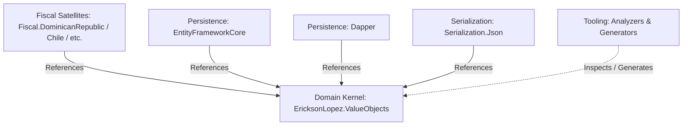
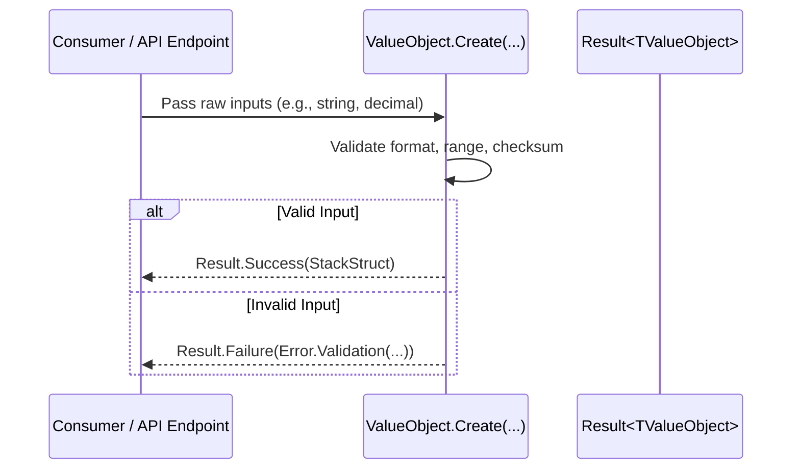

# Architecture & Design Blueprint

> **Architecture Style:** Pure Domain-Driven Design (DDD) · Clean Architecture · Native AOT-First

---

## 1. Clean Architecture Layering & Unidirectional Flow

The solution strictly adheres to the dependency inversion principle. The domain kernel (`EricksonLopez.ValueObjects`) resides at the center and depends on no external frameworks or persistence libraries:



---

## 2. Zero-Allocation Struct Layout

All scalar numeric, temporal, and financial types are implemented as `readonly record struct` instances. They reside directly on the thread stack during operations or inline within entity class heap buffers:

```text
Class-based Value Object (Traditional):
[ Heap Object Header: 16B ] -> [ Method Table: 8B ] -> [ Fields: 24B ] => ~48 bytes on Heap + GC Pointer

Struct-based Value Object (EricksonLopez.ValueObjects):
[ Direct Memory / Stack: 24B ] => 0 bytes on Heap, 0 GC overhead
```

---

## 3. Invariant Validation Pipeline


