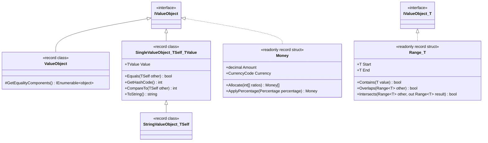
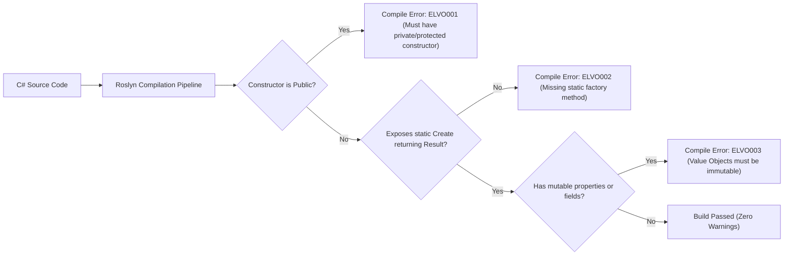

# Architectural Blueprint & Formal Specification

## 1. Executive Summary

`EricksonLopez.ValueObjects` solves the fundamental problem of **Primitive Obsession** and domain integrity in high-performance enterprise .NET 10 systems without incurring runtime reflection penalties, serialization leaks, or infrastructure coupling.

Designed strictly around **.NET 10 (C# 13 / C# 14) Native AOT semantics**, the ecosystem establishes a pure domain core (`EricksonLopez.ValueObjects`), supported by compile-time Roslyn Source Generators (`EricksonLopez.ValueObjects.Generators`), compile-time architectural Analyzers (`EricksonLopez.ValueObjects.Analyzers`), and decoupled integration adapters for `System.Text.Json`, `Dapper`, and `EntityFrameworkCore`.

```mermaid
graph TD
    subgraph "L0 Foundation Layer"
        ELResult["EricksonLopez.Result"]
        ELDomainPrimitives["EricksonLopez.DomainPrimitives.Abstractions"]
    end

    subgraph "L1 Core Domain Layer"
        ELVO["EricksonLopez.ValueObjects (Core)"]
        ELVOFiscalDO["EricksonLopez.ValueObjects.Fiscal.DominicanRepublic"]
        ELVOFiscalMX["EricksonLopez.ValueObjects.Fiscal.Mexico"]
        ELVOFiscalAR["EricksonLopez.ValueObjects.Fiscal.Argentina"]
        ELVOFiscalCL["EricksonLopez.ValueObjects.Fiscal.Chile"]
        ELVOFiscalCO["EricksonLopez.ValueObjects.Fiscal.Colombia"]
        ELVOFiscalPE["EricksonLopez.ValueObjects.Fiscal.Peru"]
    end

    subgraph "L1 Roslyn Infrastructure"
        ELAnalyzers["EricksonLopez.ValueObjects.Analyzers"]
        ELGenerators["EricksonLopez.ValueObjects.Generators"]
    end

    subgraph "L2 Integration & Persistence Adapters"
        ELBridge["EricksonLopez.ValueObjects.DomainPrimitives"]
        ELJson["EricksonLopez.ValueObjects.Serialization.Json"]
        ELDapper["EricksonLopez.ValueObjects.Dapper"]
        ELEFCore["EricksonLopez.ValueObjects.EntityFrameworkCore"]
    end

    ELVO --> ELResult
    ELVOFiscalDO --> ELVO
    ELVOFiscalMX --> ELVO
    ELVOFiscalAR --> ELVO
    ELVOFiscalCL --> ELVO
    ELVOFiscalCO --> ELVO
    ELVOFiscalPE --> ELVO

    ELBridge --> ELVO
    ELBridge --> ELDomainPrimitives
    ELJson --> ELVO
    ELDapper --> ELVO
    ELEFCore --> ELVO

    ELAnalyzers -.->|Compile-time Diagnostic Enforcement| ELVO
    ELGenerators -.->|Compile-time Code Generation| ELVO
```

---

## 2. Strategic Design Pillars

1. **Domain Purity & Invariant Protection**: Every Value Object is self-validating upon instantiation via explicit functional `Result<T>` factories. Invalid domain states cannot exist at runtime.
2. **Native AOT & Trimming Compliant**: Zero reflection, zero `MakeGenericType`, and zero dynamic IL generation in domain hot paths.
3. **Zero-Allocation Awareness**: Leverages C# record semantics (`sealed record class` for composite types, `readonly record struct` for numeric and scalar types) to eliminate GC Gen0 pressure.
4. **Decoupled Boundary Isolation**: Persistence (`Dapper`, `EF Core`) and serialization (`System.Text.Json`) adapters reside in separate satellite packages.
5. **Regulatory Fiscal Satellites**: Country-specific tax identifiers (e.g. `Rnc`, `Rfc`, `Cuit`, `Rut`, `Nit`, `Ruc`) are isolated into dedicated satellite packages.

---

## 3. Type Hierarchy & Representation Matrix

### Deterministic Choice Rules:

| Archetype | C# Implementation | Target Use Cases | Examples |
|---|---|---|---|
| **Value-Type Structs** | `readonly record struct` | Invariant numbers, temporal scalars, rates, codes, and validated string-wrapper structs requiring zero heap allocations | `Money`, `CurrencyCode`, `Email`, `PhoneNumber`, `Percentage`, `TaxRate`, `DiscountRate`, `Quantity`, `BusinessDate`, `DateRange`, `ExchangeRate` |
| **Composite Multi-Property** | `sealed record class : ValueObject` | Multi-property structures requiring structural value equality | `Address`, `FullName`, `TimeRange` |
| **Normalized Text Scalar** | `sealed record class : StringValueObject<TSelf>` | Single string VOs using `StringPipeline` validation and sanitization | `FirstName`, `LastName`, `CompanyName`, `Country`, `PostalCode`, `DocumentNumber`, `TenantCode`, `Barcode`, `SKU`, `FileName` |
| **Continuous Intervals** | `readonly record struct Range<T>` + `static class RangeExtensions` | Mathematical, temporal, or decimal intervals with boundary, overlap, and intersection logic; `RangeExtensions` provides LINQ-style helpers (e.g., `Merge`, `Gap`) | `Range<DateOnly>`, `Range<decimal>`, `Range<int>` |

---

## 4. Compile-Time Roslyn Analyzers

The `EricksonLopez.ValueObjects.Analyzers` package enforces DDD architectural invariants at build-time:

---

## 5. Persistence Mapping Strategy (Dapper & EF Core)

Domain Value Objects remain 100% pure and have no database annotations or ORM dependencies.

### 5.1 Dapper TypeHandlers (`EricksonLopez.ValueObjects.Dapper`)
- `SingleValueObjectTypeHandler<TValueObject, TRaw>`: Handles single-property reference-type Value Objects.
- `StructValueObjectTypeHandler<TValueObject, TRaw>`: Handles `readonly record struct` Value Objects.
- `ValueObjectTypeHandler.Register<TValueObject, TRaw>(...)`: Centralized registration utility.

### 5.2 Entity Framework Core (`EricksonLopez.ValueObjects.EntityFrameworkCore`)
- `ValueObjectModelConfigurationExtensions.ConfigureDomainValueObjects(ModelConfigurationBuilder)`: Auto-registers standard ValueConverters for `Email`, `PhoneNumber`, `PostalCode`, `CurrencyCode`, `Quantity`, `Percentage`, `TaxRate`.
- Generic open converters `StringValueObjectValueConverter<TVO>` and `SingleValueObjectValueConverter<TVO, TRaw>` support all domain and fiscal value objects.

---

## 6. Testing & Quality Policy

Every Value Object in the ecosystem is verified against 5 distinct testing axes:

1. **Factory Success**: Valid data constructs the VO, normalizes formatting (whitespace collapse, casing), and sets `IsSuccess = true`.
2. **Factory Failure**: `null`, empty, whitespace-only, out-of-range, or malformed inputs return `Result<T>.Failure` with domain-specific error codes.
3. **Immutability & Structural Equality**: Two instances with identical normalized values are equal (`==`, `Equals()`, same `GetHashCode()`).
4. **Boundary & Precision Invariants**: Edge boundaries (e.g., 0% and 100% in `Percentage`, max 6 decimal places).
5. **Business Operations**: Domain methods (e.g., `Money.Allocate`, `DateRange.Overlaps`, `TimeRange.Overlaps`) enforce business rules and reject invalid operations.
