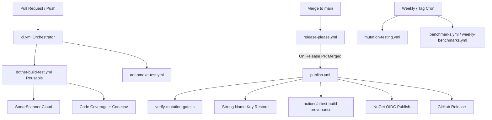

# CI/CD Pipelines & Automation Architecture

> **DevSecOps Reference:** GitHub Actions, Quality Gates, and Release Workflows for `EricksonLopez.ValueObjects`

---

## 1. Workflow Architecture & Hierarchy

The continuous integration and continuous deployment infrastructure is organized into 9 coordinated GitHub Actions workflows:

---

## 2. Workflows Specification

| Workflow File | Trigger | Responsibility | Quality Gate |
|---|---|---|---|
| `ci.yml` | `push`, `pull_request` on `main`, `develop` | Orchestrates parallel test build and NativeAOT smoke testing | All jobs pass |
| `dotnet-build-test.yml` | Reusable `workflow_call` | Restores SNK, builds in Release, executes tests, collects coverage, scans SonarCloud | WarningsAsErrors, Codecov upload |
| `aot-smoke-test.yml` | `workflow_call`, `push`, `pull_request`, `workflow_dispatch` | Installs clang/lld, compiles `NativeAotTests` with `PublishAot=true`, executes native binary | Zero IL2026/IL3050 warnings, exit code 0 |
| `benchmarks.yml` | `workflow_dispatch`, tag `v*` | Runs BenchmarkDotNet with `--job short` across .NET 8, 9, 10, commits baseline | Baseline captured |
| `weekly-benchmarks.yml` | Weekly Sunday `02:00 UTC`, `workflow_dispatch` | Deep multi-framework benchmark run without `--job short` | Statistical baseline captured |
| `mutation-testing.yml` | Weekly Sunday `04:00 UTC`, `workflow_dispatch` | Runs Stryker.NET mutation testing, sets commit status | Mutation score ≥ 95% |
| `publish.yml` | Merged Release PR (via Release Please), tag `v*.*.*`, `workflow_dispatch` | Verifies Stryker gate, signs, packs 13 packages, attests Sigstore provenance, publishes via OIDC | Verified release gates |
| `release-please.yml` | Push to `main` | Analyzes Conventional Commits, creates release PRs and tags | Valid SemVer tag |
| `repo-compliance.yml` | Push/PR to `main`, `workflow_dispatch` | Executes `verify-compliance.ps1`, validates kebab-case, headers, and package packing | 0 violations |
