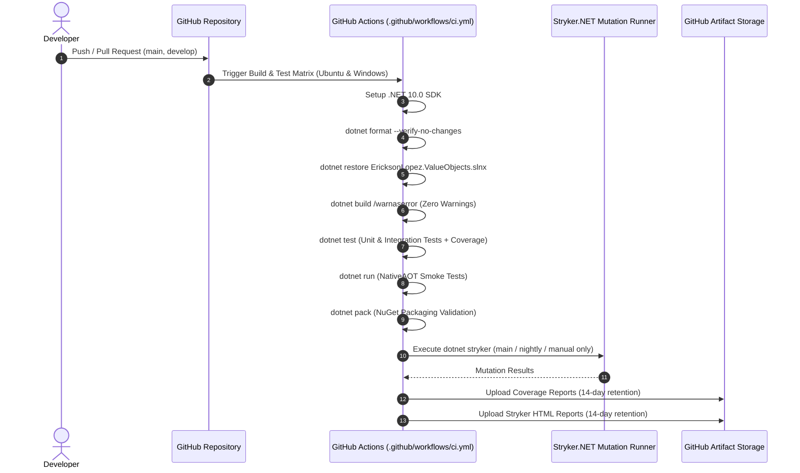

# CI/CD Pipeline & Quality Gates Specification

## 1. Overview & Architecture

The `EricksonLopez.ValueObjects` continuous integration and delivery architecture is automated via GitHub Actions, designed to guarantee zero warnings, full cross-platform compatibility, 100% test pass rate, 100% code coverage, and 100% mutation test score.

---

## 2. GitHub Actions Workflows

### 2.1 Workflow: Continuous Integration & Quality Gates (`.github/workflows/ci.yml`)

**Trigger Events**:

| Event | Condition |
|---|---|
| `push` | Branches: `main`, `develop` |
| `pull_request` | Branches: `main`, `develop` |
| `schedule` | Nightly at 03:00 UTC (`0 3 * * *`) |
| `workflow_dispatch` | Manual on-demand trigger |

**Operating System Matrix**:
- `ubuntu-latest` (Linux x64)
- `windows-latest` (Windows x64)
- Strategy: `fail-fast: false` (both environments run fully even if one encounters a transient issue).

**Pipeline Steps & Commands**:

| Step | Command / Action | Notes |
|---|---|---|
| Checkout | `actions/checkout@v4` (`fetch-depth: 0`) | Preserves full Git commit history |
| SDK Setup | `actions/setup-dotnet@v4` (`dotnet-version: '10.0.x'`) | Installs .NET 10 SDK |
| Format Check | `dotnet format --verify-no-changes --verbosity normal` | Enforces `.editorconfig` code style |
| Restore | `dotnet restore EricksonLopez.ValueObjects.slnx` | Restores all NuGet dependencies |
| Build | `dotnet build ... --configuration Release --no-restore /warnaserror /p:ContinuousIntegrationBuild=true` | Fails on any compiler warning |
| Test | `dotnet test ... --configuration Release --no-build --nologo --coverlet --coverlet-output-format opencover` | Runs all test projects; collects Coverlet MTP coverage |
| NativeAOT Smoke | `dotnet run --project tests/EricksonLopez.ValueObjects.NativeAotTests/... --configuration Release --no-build` | Validates AOT publish/run |
| NuGet Pack | `dotnet pack ... --configuration Release --no-build` | Validates all 13 packages pack without errors |
| Mutation Testing | `dotnet tool install -g dotnet-stryker` + `dotnet stryker --config-file stryker-config.json` | **Only on:** `main` push, nightly schedule, or manual dispatch |
| Upload Coverage | `actions/upload-artifact@v4` → `coverage-reports-{os}` | 14-day retention; `always()` condition |
| Upload Stryker | `actions/upload-artifact@v4` → `stryker-reports-{os}` | 14-day retention; only when Stryker runs |

---

## 3. Quality Gates & Thresholds

| Quality Gate | Tool | Configuration | Threshold |
|---|---|---|:---:|
| **Code Style** | `dotnet format` | `.editorconfig` | **Zero formatting violations** |
| **Compiler Warnings** | Roslyn / MSBuild | `<TreatWarningsAsErrors>true</TreatWarningsAsErrors>` | **0 Warnings Allowed** |
| **Line Coverage** | Coverlet | `coverlet.runsettings` | **100%** |
| **Branch Coverage** | Coverlet | `coverlet.runsettings` | **100%** |
| **Mutation Score** | Stryker.NET | `stryker-config.json` (`high: 100, low: 98, break: 95`) | **100%** |
| **Native AOT** | .NET NativeAOT | `IsAotCompatible=true`, `IsTrimmable=true` | **100% Pass** |
| **NuGet Packaging** | `dotnet pack` | `Directory.Build.props` metadata | **0 pack errors** |

---

## 4. Branch & Release Strategy

### 4.1 Branch Conventions

Based on CI trigger patterns:

| Branch | Purpose | CI Trigger |
|---|---|---|
| `main` | Production trunk — merged via approved PR | Push + PR + Nightly schedule |
| `develop` | Active integration branch for feature aggregation | Push + PR |
| `feature/*` | New Value Object or feature branches — merge into `develop` | PR trigger |
| `fix/*` | Bug fix branches — merge into `develop` | PR trigger |
| `refactor/*` | Refactoring branches — merge into `develop` | PR trigger |
| `docs/*` | Documentation-only branches | PR trigger |

### 4.2 Release Procedure

1. Update `<VersionPrefix>` in `Directory.Build.props` to the target Semantic Version (e.g., `1.0.0`).
2. Create a version tag matching the prefix (e.g., `v1.0.0`).
3. NuGet packages are packed with deterministic symbols (`.snupkg`) and SourceLink via `EmbedUntrackedSources=true`, `IncludeSymbols=true`, `SymbolPackageFormat=snupkg`.
4. CI validates packaging via `dotnet pack` before the tag is promoted.

### 4.3 Supply Chain Integrity

| Mechanism | Implementation |
|---|---|
| **Deterministic Builds** | `<ContinuousIntegrationBuild>true</ContinuousIntegrationBuild>` in CI/CD |
| **Source Link** | `<EmbedUntrackedSources>true</EmbedUntrackedSources>` + `<PublishRepositoryUrl>true</PublishRepositoryUrl>` |
| **Symbol Packages** | `.snupkg` via `<SymbolPackageFormat>snupkg</SymbolPackageFormat>` |
| **CPM Pinning** | All dependencies pinned in `Directory.Packages.props` with `CentralPackageTransitivePinningEnabled=true` |
| **Zero Warnings** | `<TreatWarningsAsErrors>true</TreatWarningsAsErrors>` + `AnalysisLevel=latest-recommended` |
