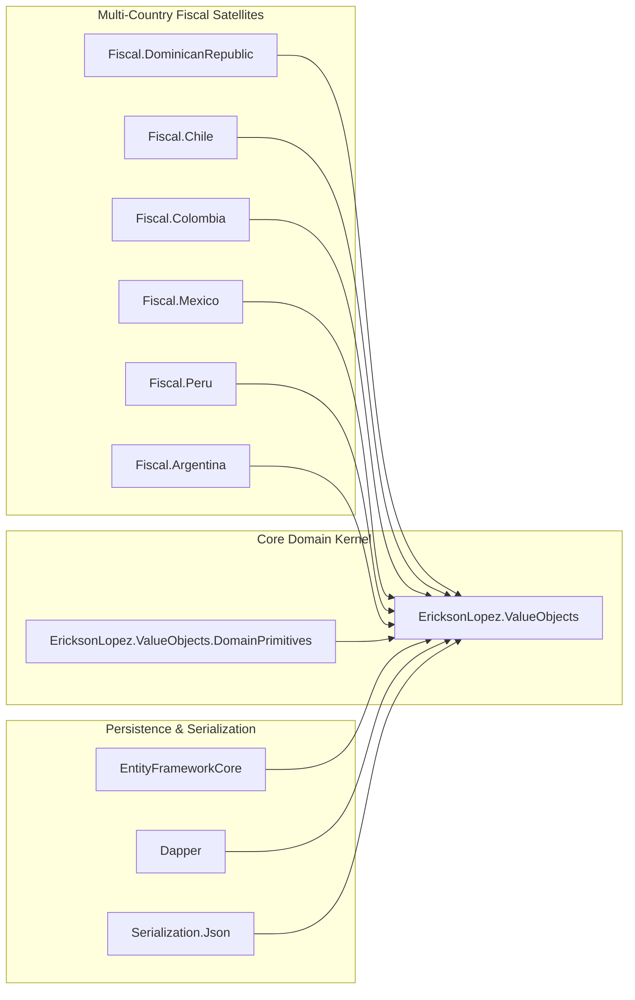
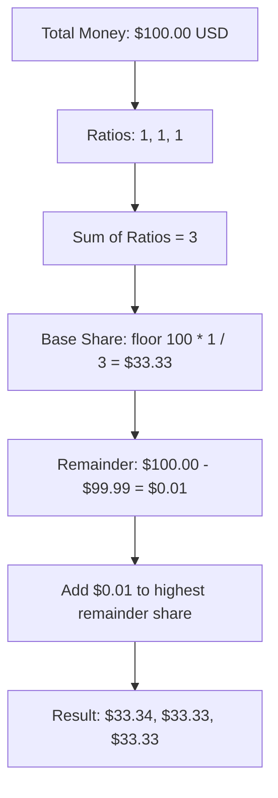
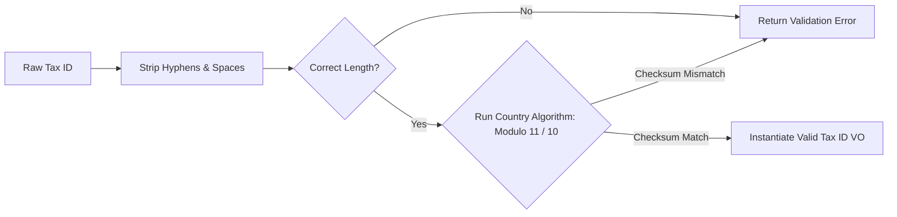

# Architectural Diagrams & Visual Maps

> **Visual Reference Blueprint for `EricksonLopez.ValueObjects`**

---

## 1. System Topology

---

## 2. Money Allocation Flow

---

## 3. Fiscal Verification Pipeline

