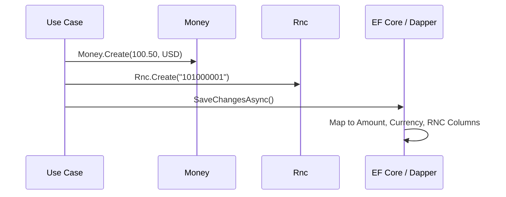

# Functional Map & Topology

---

## 1. Value Object Domain Flow

```mermaid
sequenceDiagram
    participant App as Use Case
    participant MoneyVO as Money
    participant Fiscal as Rnc
    participant DB as EF Core / Dapper

    App->>MoneyVO: Money.Create(100.50, USD)
    App->>Fiscal: Rnc.Create("101000001")
    App->>DB: SaveChangesAsync()
    DB->>DB: Map to Amount, Currency, RNC Columns
```
