# NuGet Package Ecosystem Catalog

The `EricksonLopez.ValueObjects` repository produces **13 specialized NuGet packages**, organized into Core Domain, Roslyn Tooling, Persistence Adapters, Serialization, and Fiscal Satellites.

---

## 1. Package Inventory & Summary

```mermaid
graph TD
    subgraph "Core Domain"
        VO["EricksonLopez.ValueObjects"]
    end

    subgraph "Roslyn Tooling"
        Analyzers["EricksonLopez.ValueObjects.Analyzers"]
        Generators["EricksonLopez.ValueObjects.Generators"]
    end

    subgraph "Persistence & Serialization"
        Bridge["EricksonLopez.ValueObjects.DomainPrimitives"]
        Json["EricksonLopez.ValueObjects.Serialization.Json"]
        Dapper["EricksonLopez.ValueObjects.Dapper"]
        EFCore["EricksonLopez.ValueObjects.EntityFrameworkCore"]
    end

    subgraph "Fiscal Satellites"
        FiscalDO["EricksonLopez.ValueObjects.Fiscal.DominicanRepublic"]
        FiscalMX["EricksonLopez.ValueObjects.Fiscal.Mexico"]
        FiscalAR["EricksonLopez.ValueObjects.Fiscal.Argentina"]
        FiscalCL["EricksonLopez.ValueObjects.Fiscal.Chile"]
        FiscalCO["EricksonLopez.ValueObjects.Fiscal.Colombia"]
        FiscalPE["EricksonLopez.ValueObjects.Fiscal.Peru"]
    end

    FiscalDO --> VO
    FiscalMX --> VO
    FiscalAR --> VO
    FiscalCL --> VO
    FiscalCO --> VO
    FiscalPE --> VO

    Bridge --> VO
    Json --> VO
    Dapper --> VO
    EFCore --> VO
```

---

## 2. Detailed Package Specifications

### 2.1 `EricksonLopez.ValueObjects`
- **Target Framework**: `net10.0`
- **Purpose**: Pure domain Value Object framework.
- **Key Types Exported**:
  - *Interfaces*: `IValueObject`, `IValueObject<T>`
  - *Base types*: `ValueObject`, `SingleValueObject<TSelf, TValue>`, `StringValueObject<TSelf>`
  - *Generic*: `Range<T>`, `RangeExtensions`
  - *Monetary*: `Money`, `CurrencyCode`
  - *Contact*: `Email`, `PhoneNumber`, `PostalCode`
  - *Numeric*: `Percentage`, `TaxRate`, `DiscountRate`, `Quantity`
  - *Identity & Personal*: `FullName`, `FirstName`, `MiddleName`, `LastName`, `DisplayName`, `NationalId`, `PassportNumber`
  - *Security*: `PasswordHash`
  - *Temporal*: `DateRange`, `TimeRange`, `BusinessDate`
  - *Location*: `Address`, `Country`
  - *Attributes*: `ValueObjectAttribute`, `SensitiveDataAttribute`, `RegulatoryRuleAttribute`
  - *Exceptions*: `DomainException`
- **Direct Dependencies**: `EricksonLopez.Result` (L0 Foundation).

### 2.2 `EricksonLopez.ValueObjects.Analyzers`
- **Target Framework**: `netstandard2.0`
- **Purpose**: Roslyn Diagnostic Analyzers enforcing DDD invariants at compile time.
- **Rules**:
  - `ELVO001`: Private/protected constructors required.
  - `ELVO002`: Static `Create(...)` returning `Result<T>` required.
  - `ELVO003`: Absolute immutability enforced (no mutable properties/fields).
- **Direct Dependencies**: `Microsoft.CodeAnalysis.CSharp`, `Microsoft.CodeAnalysis.Analyzers`.

### 2.3 `EricksonLopez.ValueObjects.Generators`
- **Target Framework**: `netstandard2.0`
- **Purpose**: Incremental Source Generator generating `IParsable<TSelf>` and `ISpanParsable<TSelf>` implementations for types decorated with `[ValueObject]`.
- **Direct Dependencies**: `Microsoft.CodeAnalysis.CSharp`, `Microsoft.CodeAnalysis.Analyzers`.

### 2.4 `EricksonLopez.ValueObjects.DomainPrimitives`
- **Target Framework**: `net10.0`
- **Purpose**: Bidirectional bridge between `EricksonLopez.ValueObjects` and `EricksonLopez.DomainPrimitives.Abstractions`.
- **Key Types**: `ValueObjectDomainPrimitiveExtensions` (`ToDomainPrimitive`, `ToStrongId`), `DomainPrimitiveErrorExtensions`.
- **Direct Dependencies**: `EricksonLopez.ValueObjects`, `EricksonLopez.DomainPrimitives.Abstractions`.

### 2.5 `EricksonLopez.ValueObjects.Serialization.Json`
- **Target Framework**: `net10.0`
- **Purpose**: Native AOT System.Text.Json converters for Value Objects and `Range<T>`.
- **Key Types**: `SingleValueObjectJsonConverter<TSelf, TValue>`, `StringValueObjectJsonConverter<TSelf>`, `RangeJsonConverter<T>`.
- **Direct Dependencies**: `EricksonLopez.ValueObjects`.

### 2.6 `EricksonLopez.ValueObjects.Dapper`
- **Target Framework**: `net10.0`
- **Purpose**: Dapper `SqlMapper.TypeHandler` persistence adapters.
- **Key Types**: `SingleValueObjectTypeHandler<TValueObject, TRaw>`, `StructValueObjectTypeHandler<TValueObject, TRaw>`, `ValueObjectTypeHandler`.
- **Direct Dependencies**: `EricksonLopez.ValueObjects`, `Dapper`.

### 2.7 `EricksonLopez.ValueObjects.EntityFrameworkCore`
- **Target Framework**: `net10.0`
- **Purpose**: Entity Framework Core ValueConverters and model builder conventions.
- **Key Types**: `StringValueObjectValueConverter<TVO>`, `SingleValueObjectValueConverter<TVO, TRaw>`, `ValueObjectModelConfigurationExtensions.ConfigureDomainValueObjects`.
- **Direct Dependencies**: `EricksonLopez.ValueObjects`, `Microsoft.EntityFrameworkCore`.

### 2.8 Fiscal Satellites (`.Fiscal.*`)
- **Target Framework**: `net10.0`
- **Packages**:
  - `EricksonLopez.ValueObjects.Fiscal.DominicanRepublic`: `Rnc`, `Cedula`, `Ncf`, `ElectronicNcf`, `FiscalPeriod`, `SecurityCode`.
  - `EricksonLopez.ValueObjects.Fiscal.Mexico`: `Rfc`, `Curp`, `FiscalUuid`, `IdCcp`, `PedimentoNumber`, `TaxRegimeCode`, `PaymentFormCode`, `CfdiUsageCode`.
  - `EricksonLopez.ValueObjects.Fiscal.Argentina`: `Cuit`, `Cuil`, `Cbu`, `Cvu`, `Cae`, `Caea`, `Cai`, `PointOfSale`, `VoucherNumber`, `VoucherType`, `VoucherLetter`, `VatRate`, `JurisdictionCode`.
  - `EricksonLopez.ValueObjects.Fiscal.Chile`: `Rut`, `FiscalFolio`, `DteTypeCode`, `DocumentReference`, `TaxRateVat`, `WithholdingRate`.
  - `EricksonLopez.ValueObjects.Fiscal.Colombia`: `Nit`, `Cufe`, `Cude`, `Cune`, `DaneMunicipalityCode`, `CiiuCode`, `AuthorizationRange`, `RejectionReasonCode`, `TaxTypeCode`.
  - `EricksonLopez.ValueObjects.Fiscal.Peru`: `Ruc`, `CpeIdentifier`, `CpeTypeCode`, `DetractionAccount`, `UbigeoCode`, `TaxPeriod`, `SunatProductCode`.
- **Direct Dependencies**: `EricksonLopez.ValueObjects`.

---

## 3. Central Package Management (CPM) Inventory

All external dependencies are managed centrally in `Directory.Packages.props`:

| Package Dependency | Pinned Version | Scope / Usage |
|---|:---:|---|
| `Microsoft.CodeAnalysis.CSharp` | `4.12.0` | Roslyn Analyzers & Generators |
| `Microsoft.CodeAnalysis.Analyzers` | `3.11.0` | Roslyn Tooling |
| `EricksonLopez.Result` | `1.0.0` | Foundation Functional Result Monad |
| `EricksonLopez.DomainPrimitives.Abstractions` | `1.0.0` | Primitive abstraction bridge |
| `Dapper` | `2.1.66` | Dapper persistence integration |
| `Microsoft.EntityFrameworkCore` | `10.0.0` | EF Core integration |
| `Microsoft.NET.Test.Sdk` | `17.13.0` | Testing host |
| `xunit.v3` | `2.0.0` | Test framework |
| `xunit.runner.visualstudio` | `3.0.2` | Test runner |
| `AwesomeAssertions` | `9.5.0` | Semantic test assertions |
| `Bogus` | `35.6.2` | Fake data generation |
| `NSubstitute` | `5.3.0` | Test mocking |
| `coverlet.collector` | `6.0.4` | Code coverage collector |
| `BenchmarkDotNet` | `0.14.0` | Performance benchmarking |

---

## 4. Native AOT & Trimming Compatibility Matrix

| Package | `IsAotCompatible` | `IsTrimmable` | Dynamic Reflection |
|---|:---:|:---:|:---:|
| `EricksonLopez.ValueObjects` | :white_check_mark: `true` | :white_check_mark: `true` | **Zero (0)** |
| `EricksonLopez.ValueObjects.Analyzers` | N/A (Build tool) | N/A | N/A |
| `EricksonLopez.ValueObjects.Generators` | N/A (Build tool) | N/A | N/A |
| `EricksonLopez.ValueObjects.DomainPrimitives` | :white_check_mark: `true` | :white_check_mark: `true` | **Zero (0)** |
| `EricksonLopez.ValueObjects.Serialization.Json` | :white_check_mark: `true` | :white_check_mark: `true` | **Zero (0)** |
| `EricksonLopez.ValueObjects.Dapper` | :white_check_mark: `true` | :white_check_mark: `true` | **Zero (0)** |
| `EricksonLopez.ValueObjects.EntityFrameworkCore` | :white_check_mark: `true` | :white_check_mark: `true` | **Zero (0)** |
| `EricksonLopez.ValueObjects.Fiscal.*` (All 6) | :white_check_mark: `true` | :white_check_mark: `true` | **Zero (0)** |
