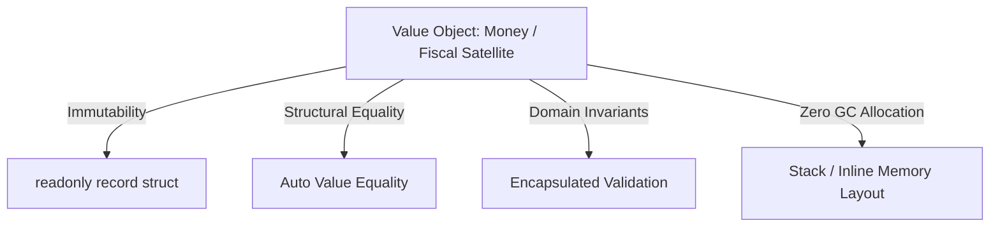

# Level 00 — Architecture & Foundational Philosophy

Welcome to the **EricksonLopez.ValueObjects** interactive showcase.

---

## 🎯 The Purpose of Value Objects in Domain-Driven Design

In DDD, a **Value Object** is an immutable conceptual model characterized exclusively by its structural properties rather than a thread of continuous identity.

