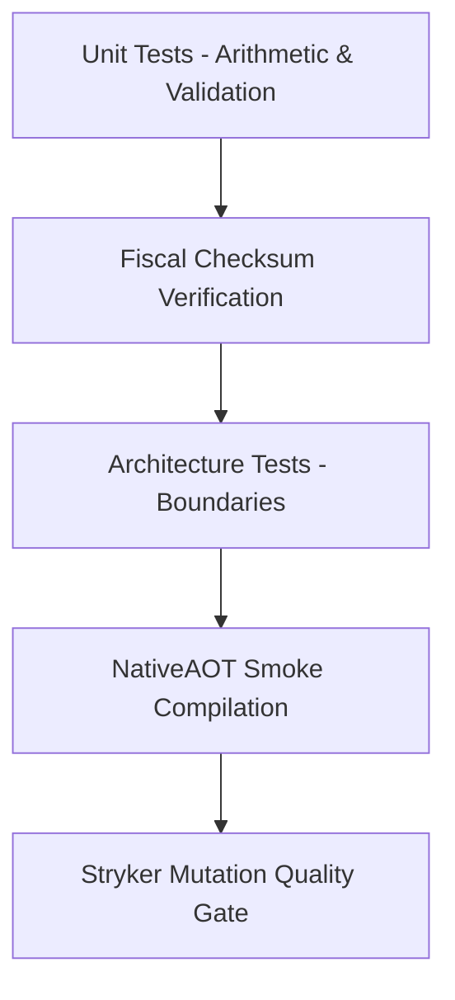

# Testing Strategy & Quality Roadmap

---

## 1. Testing Topology

- **Unit Tests**: Arithmetic operator precision, currency safety, and address components.
- **Fiscal Tests**: Official modulo 11 / Luhn checksum validation for all supported countries.
- **AOT Smoke Tests**: Standalone native binary execution with `PublishAot=true`.
